# 神经网络与深度学习 (Neural Network and Deep Learning)
## 单元1
### ReLU 函数 (Rectified Linear Unit, 线性整流函数) 
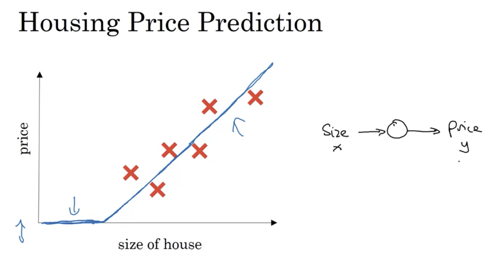

### 输入层、隐藏层
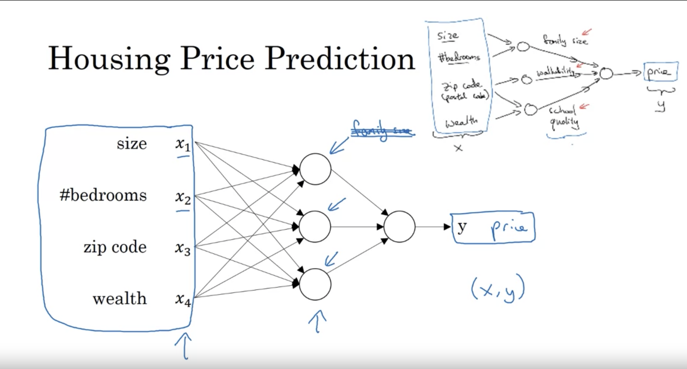

左侧的 x1, x2, x3, x4 是**输入层**

中间的三个神经元是**隐藏层**，隐藏层是全连接的，会接收所有特征作为输入。


### **卷积神经网络与循环神经网络**
**卷积神经网络 (Convolutional Neural Network, CNN)**：用于图像处理，属于监督学习

**循环神经网络 (Recurrent Neural Network, RNN)**：用于处理序列化数据，属于监督学习

**结构化数据 (Structured Data)**：如数据库表格

**非结构化数据 (Unstructured Data)**：如音频、图像、文本


### 深度学习怎么行的
**数据规模驱动深度学习进步 (Scale Drives Deep Learning Progress)**：标注数据规模 + 神经网络规模

**新算法 (New Algorithms)**

**计算能力 (Computation)** - GPU 加速


## 单元2
### 计算机如何存储图片 (How Computer Stores a Picture)
分别存储三个矩阵，对应红、绿、蓝三个颜色通道；

如果图片是 64×64 像素，则有三个 64×64 的矩阵，分别存储 RGB 各通道的像素强度值。

将所有矩阵展开得到一个特征向量——展开 (unroll) 所有矩阵为一维向量作为 x，则 x 是一个长度为 64×64×3=12288 的一维向量。


### 符号表示
一个训练样本 (training example) 用一对值表示：(x, y)，其中 x ∈ R^(n_x)（n_x 维特征向量），y ∈ {0, 1}

使用 n 或 n_x 表示特征向量 X 的维度

使用 m 或 m_train 表示训练集样本数: {(x<sup>(1)</sup>, y<sup>(1)</sup>), (x<sup>(2)</sup>, y<sup>(2)</sup>), ..., (x<sup>(m)</sup>, y<sup>(m)</sup>)}

使用 m_test 表示测试集样本数

将x<sup>(1)</sup> 放在X矩阵的第一列，x<sup>(2)</sup>放在X矩阵的第二列。。。那么将得到一个 m列（训练样本个数）、n<sub>x</sub> 行（特征数）的二维矩阵X。

X∈R<sup>nx x m</sup>, X.shape = (nx, m)

Y = [y<sup>(1) </sup> , y<sup>(2)</sup> , ... y<sup>(m) </sup> ], Y.shape = (1, m)


### 逻辑回归 (Logistic Regression)
**二分类算法**，标签 Y ∈ {0, 1}

**逻辑回归 (Logistic Regression)** 是一个二分类算法，标签 Y ∈ {0, 1}

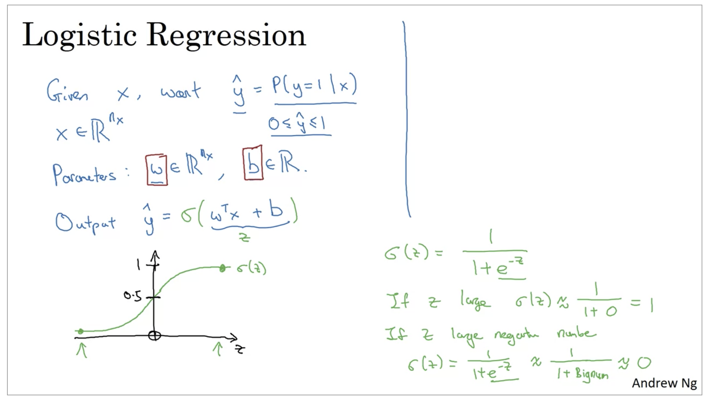

yhat：给定 x 时 y=1 的概率估计，范围 [0, 1]

参数：w（n_x 维向量），b（实数 real number）

使用 yhat = w^T x + b（线性回归 Linear Regression）处理二分类问题不合理，因为输出可能为负或大于 1。

设z=w<sup>t</sup>x+b，使用sigmoid(z)函数来表示yhat

z 越大，sigmoid(z) 越接近 1；z 越小，sigmoid(z) 越接近 0。


### 损失函数与代价函数 (Loss Function and Cost Function)
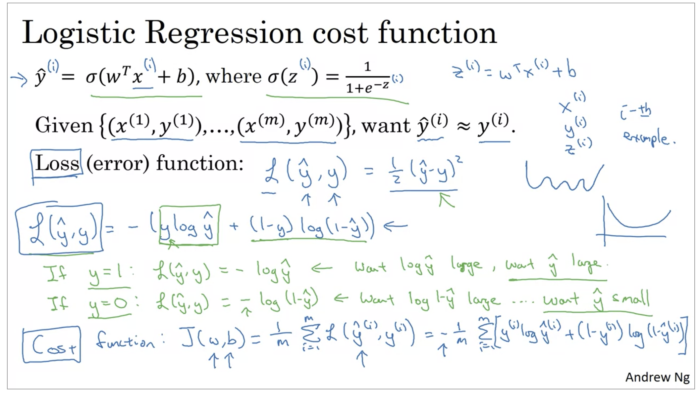

**Loss(error) function**: define to measure how good our output yhat is when the true label is y.

loss function损失函数：仅用于单独的训练样本 

在逻辑回归中，若使用 L = 1/2(yhat - y)²（平方误差 Squared Error）作为损失函数，损失函数会非凸 (non-convex)，导致梯度下降陷入局部最优而非全局最优。

因此使用交叉熵损失（cross-entropy loss）：

L = -(y·log(yhat) + (1-y)·log(1-yhat))

- 当 y=1 时，L = -log(yhat)，希望 yhat 更大（更接近 1），即 log(yhat) 更大 → L 更小
- 当 y=0 时，L = -log(1-yhat)，希望 yhat 更小（更接近 0），即 log(1-yhat) 更大 → L 更小


代价函数 (Cost Function)：整个训练集的平均损失。

代价函数是参数 W 和 B 的函数，目标是找到使代价最小的参数值。

### Gradient Descent 梯度下降
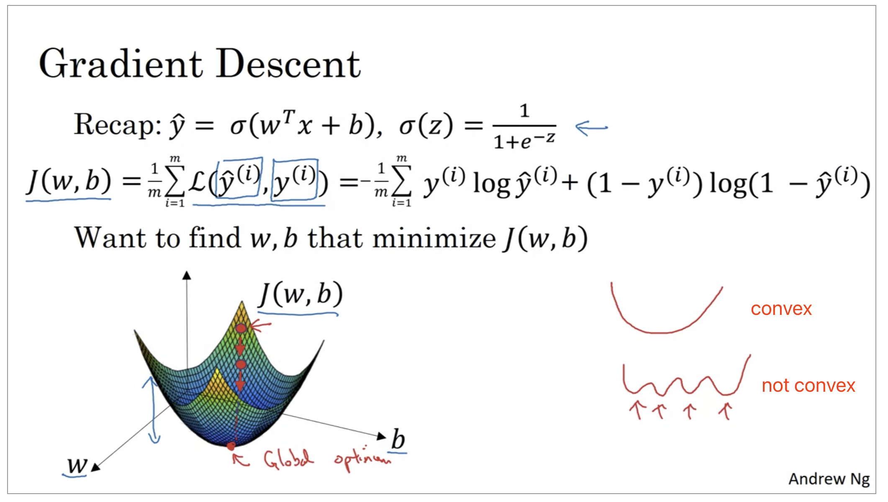

横轴：w 和 b

纵轴：代价函数 J

假设 w 和 b 均为单一实数：

每次迭代中，梯度下降沿最陡峭的下降方向迈出一步，最终收敛到全局最优或接近全局最优。


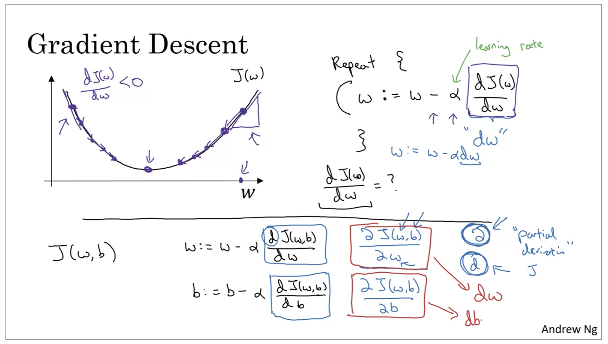

为了方便画图，先去掉参数 b。使用 “:=” 表示赋值更新：

w := w - α·(∂J/∂w)

α (alpha)：learning rate（学习率），控制每次迭代的步长。

derivative（导数）= slope of a function（函数的斜率）。dw 表示 ∂J/∂w，即 cost function 对 w 的偏导数。

- 若 w 在图中最右边的点，导数为正，w 会减小（减去 α·dw），即向左移动
- 若 w 在最左边的点，导数为负，w 会增加，即向右移动

同理，对参数 b 也使用相同公式更新。


### Computation Graph 计算图
**正向传播 (Forward Propagation)**：计算神经网络的输出

**反向传播 (Backward Propagation)**：计算梯度

**链式法则 (Chain Rule)**

在 Python 代码中，用 'dvar' 表示最终对变量 var 的求导结果（即 dJ/dvar 简化为 dvar）。


### 逻辑回归的梯度下降 (Logistic Regression Gradient Descent)
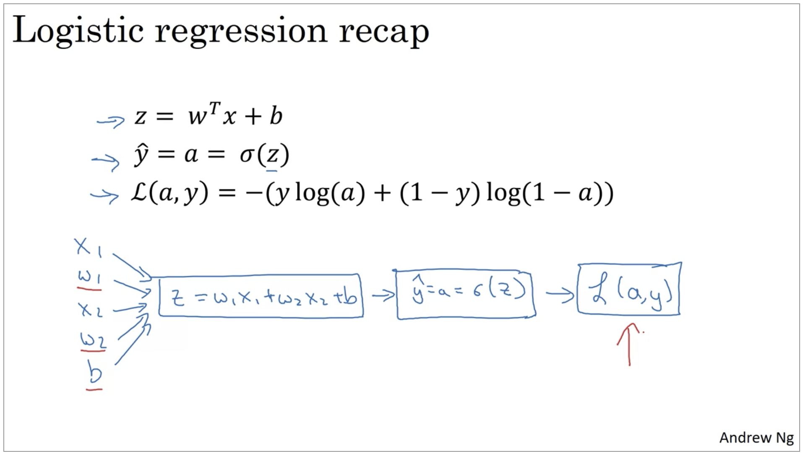

对于单个样本，假设只有 2 个特征 x1, x2，目标是调整 w1, w2, b 来减小损失函数。

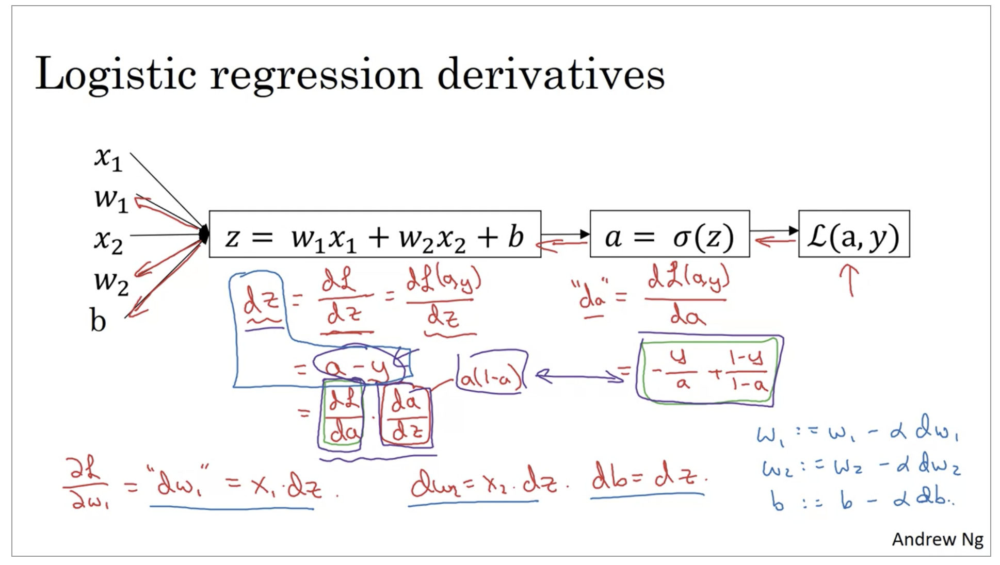

通过反向传播和链式法则，首先算出"da"，再算出"dz"为a-y，再算出dw1, dw2，最终得到w1,w2的更新函数。


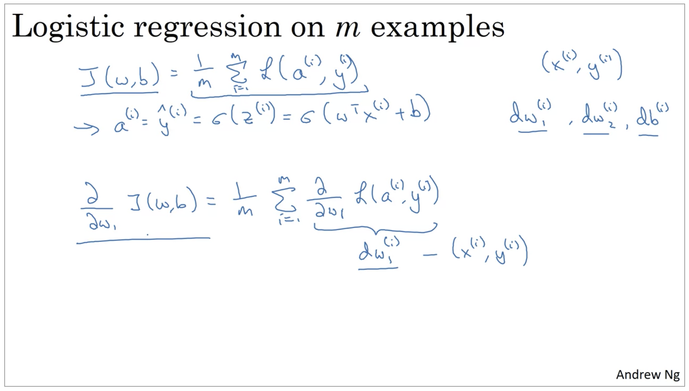

为了计算 m 个样本下的代价函数 J(w, b)，需要求所有样本损失的平均值。

此情况下求 dw1，需要对每个独立样本的损失分别求导，再取平均。

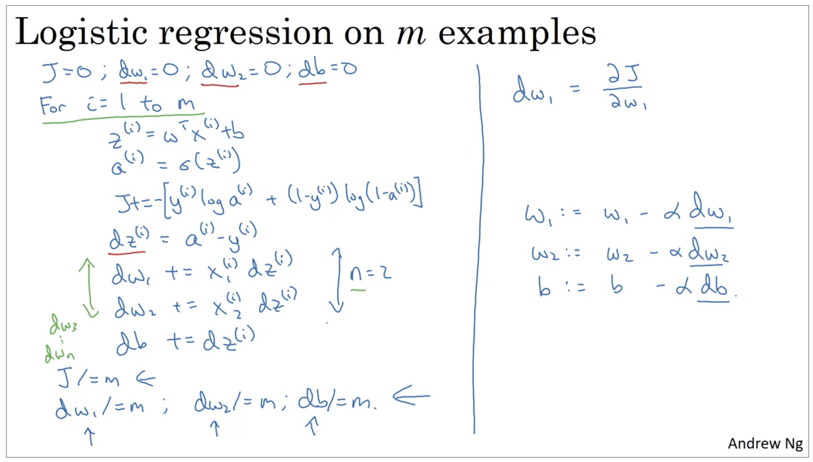

得到参数的偏导数后，对参数进行更新，实现一次梯度下降

这种方法的缺点是存在两重循环，在数据集大、特征数量多时计算效率低。

### 向量化 (Vectorization)
向量化 (Vectorization) 技术可以去除 for 循环，这在现代深度学习中非常重要。

两个向量 a = [a1, a2, …, an] 和 b = [b1, b2, …, bn] 的点积定义为：

a·b = a1·b1 + a2·b2 + …… + an·bn

使用 np.dot 计算会非常快

简单示例：

import numpy as np  
import time  
a = np.random.rand(1000000)  
b = np.random.rand(1000000)  
  
tic = time.time()  
c = np.dot(a, b)  
toc = time.time()  
print("Vectorized time: " + str(1000 * (toc - tic)) + "ms")  
  
c = 0  
tic = time.time()  
for i in range(1000000):  
    c += a[i] * b[i]  
toc = time.time()  
print("For loop time: " + str(1000 * (toc - tic)) + "ms")  


Vectorized time: 4.040956497192383ms  
For loop time: 406.5101146697998ms

使用向量化计算神经网络向前传播 - 根据输入训练样本计算预测值A:

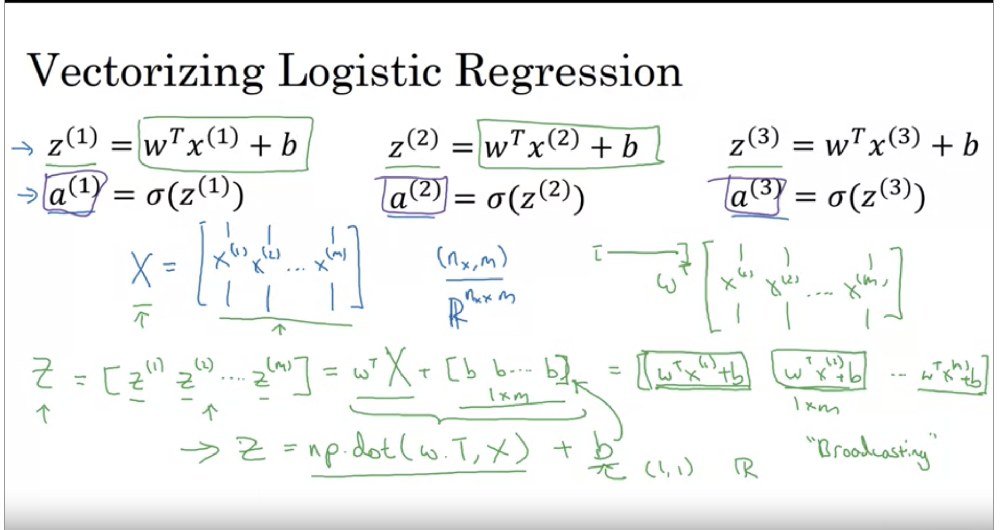

预测向量 A = [a^(1), a^(2), …, a^(m)] = σ(Z)

真实向量 Y = [y^(1), y^(2), …, y^(m)]

通过反向传播，向量 dz = A - Y 

向量 dw = [x^(1)·dz^(1), x^(2)·dz^(2), …, x^(m)·dz^(m)]

向量 db = [dz^(1), dz^(2), …, dz^(m)]

再除以样本总数 m，得到 w 和 b 的导数，对参数进行更新。


使用向量化优化逻辑回归cost function的计算：

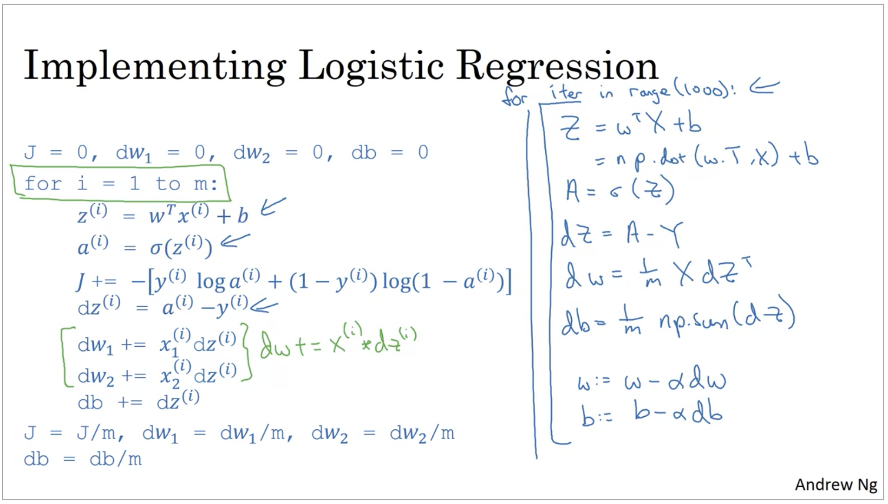

在完全不使用for-loop的情况下，完成一次梯度下降。


```python
常用函数
def basic_sigmoid(x):
    """
    Compute sigmoid of x.

    Arguments:
    x -- A scalar

    Return:
    s -- sigmoid(x)
    """
    # (≈ 1 line of code)
    # s = 
    # YOUR CODE STARTS HERE
    s = 1 / (1 + math.exp(-x))

    # YOUR CODE ENDS HERE

    return s

# GRADED FUNCTION: sigmoid

def sigmoid(x):
    """
    Compute the sigmoid of x

    Arguments:
    x -- A scalar or numpy array of any size

    Return:
    s -- sigmoid(x)
    """

    # (≈ 1 line of code)
    # s = 
    # YOUR CODE STARTS HERE
    s = 1 / (1 + np.exp(-x))

    # YOUR CODE ENDS HERE

    return s

# GRADED FUNCTION: sigmoid_derivative

def sigmoid_derivative(x):
    """
    Compute the gradient (also called the slope or derivative) of the sigmoid function with respect to its input x.
    You can store the output of the sigmoid function into variables and then use it to calculate the gradient.
    
    Arguments:
    x -- A scalar or numpy array

    Return:
    ds -- Your computed gradient.
    """

    #(≈ 2 lines of code)
    # s = 
    # ds = 
    # YOUR CODE STARTS HERE
    s = sigmoid(x)
    ds = s * (1 - s)

    # YOUR CODE ENDS HERE

    return ds

# GRADED FUNCTION:image2vector

def image2vector(image):
    """
    Argument:
    image -- a numpy array of shape (length, height, depth)
    
    Returns:
    v -- a vector of shape (length*height*depth, 1)
    """

    # (≈ 1 line of code)
    # v =
    # YOUR CODE STARTS HERE
    v = image.reshape((image.shape[0] * image.shape[1] * image.shape[2], 1))

    # YOUR CODE ENDS HERE

    return v

# GRADED FUNCTION: normalize_rows

def normalize_rows(x):
    """
    Implement a function that normalizes each row of the matrix x (to have unit length).
    
    Argument:
    x -- A numpy matrix of shape (n, m)
    
    Returns:
    x -- The normalized (by row) numpy matrix. You are allowed to modify x.
    """

    #(≈ 2 lines of code)
    # Compute x_norm as the norm 2 of x. Use np.linalg.norm(..., ord = 2, axis = ..., keepdims = True)
    # x_norm =
    # Divide x by its norm.
    # x =
    # YOUR CODE STARTS HERE
    x = x / np.linalg.norm(x, axis=1, keepdims=True)

    # YOUR CODE ENDS HERE

    return x

# GRADED FUNCTION: softmax

def softmax(x):
    """Calculates the softmax for each row of the input x.

    Your code should work for a row vector and also for matrices of shape (m,n).

    Argument:
    x -- A numpy matrix of shape (m,n)

    Returns:
    s -- A numpy matrix equal to the softmax of x, of shape (m,n)
    """

    #(≈ 3 lines of code)
    # Apply exp() element-wise to x. Use np.exp(...).
    # x_exp = ...

    # Create a vector x_sum that sums each row of x_exp. Use np.sum(..., axis = 1, keepdims = True).
    # x_sum = ...

    # Compute softmax(x) by dividing x_exp by x_sum. It should automatically use numpy broadcasting.
    # s = ...

    # YOUR CODE STARTS HERE
    x_exp = np.exp(x)
    x_sum = np.sum(x_exp, axis = 1, keepdims = True)
    s = x_exp / x_sum

    # YOUR CODE ENDS HERE

    return s

# GRADED FUNCTION: L1

    def L1(yhat, y):
    """
    Arguments:
    yhat -- vector of size m (predicted labels)
    y -- vector of size m (true labels)

    Returns:
    loss -- the value of the L1 loss function defined above
    """

    #(≈ 1 line of code)
    # loss = 
    # YOUR CODE STARTS HERE
    loss = np.sum(abs(y - yhat))

    # YOUR CODE ENDS HERE

    return loss

# GRADED FUNCTION: L2

    def L2(yhat, y):
    """
    Arguments:
    yhat -- vector of size m (predicted labels)
    y -- vector of size m (true labels)

    Returns:
    loss -- the value of the L2 loss function defined above
    """

    #(≈ 1 line of code)
    # loss = ...
    # YOUR CODE STARTS HERE
    d = y - yhat
    loss = np.sum(np.dot(d,d))

    # YOUR CODE ENDS HERE

    return loss
```

## 单元3
### 神经网络 (Neural Networks)
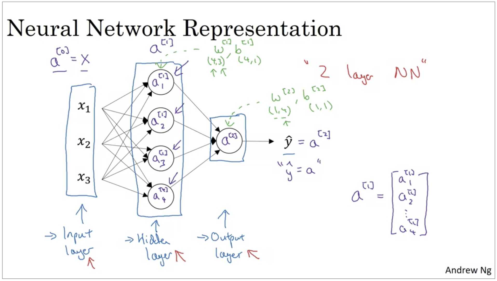

**输入层 (Input layer)**

hidden layer 隐藏层：中间层的实际值是看不到的，所以称为“隐藏”

**输出层 (Output layer)**

a^[0] 表示第0个输入层

a上标[1]下标1表示第1层生成的第一个节点

w 是列向量，w^T 是行向量

图中的神经网络称为“2 layer NN”，因为按照惯例，不把输入层作为正式的一层


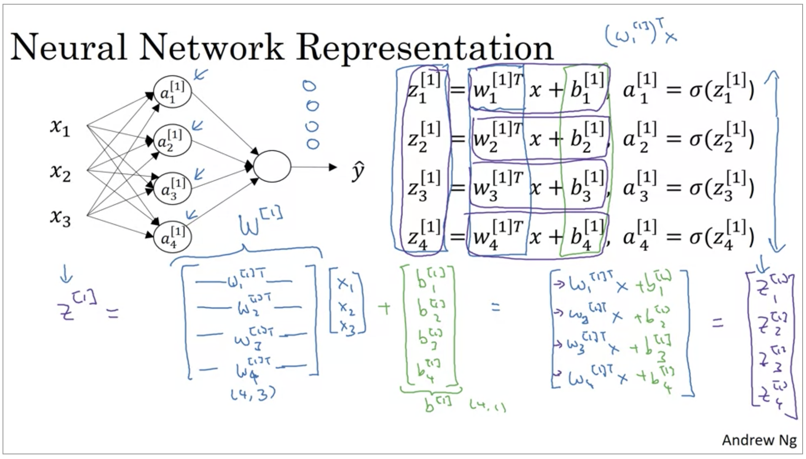

x1, x2, x3 组成特征列向量 shape=(3,1)

w1^[1]T, w2^[1]T, w3^[1]T, w4^[1]T 组成参数矩阵 shape=(4,3)

b1^[1]，b2^[1]，b3^[1]，b4^[1] 组成参数列向量 shape=(4,1)

神经网络的隐藏层节点做了和逻辑回归类似的计算，我们可以将节点堆叠起来（变成矩阵）进行向量化计算。

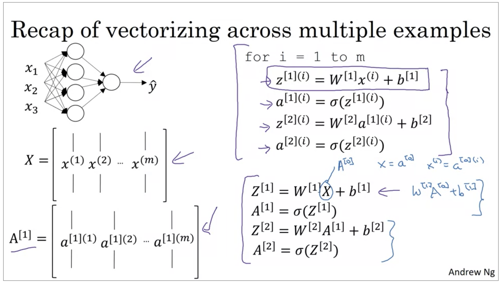

### 激活函数 (Activation Function)
之前我们使用的激活函数是sigmoid函数，有一种更优越的激活函数是 tangent function（正切函数） 或 hyperbolic tangent function（双曲线正切函数）

正切函数的范围是(-1, -1)，从图形上看，就是sigmoid往下移动（shift）了，这样的好处是隐藏层更接近均值为0，某种程度上使下一层的学习变得更容易了（？）。

因此我们几乎再也不使用sigmoid作为激活函数了，只用当我们处理二分类（binary classification）问题时，0<=yhat<=1，我们才使用sigmoid。

另一种在机器学习中非常流行的选择是所谓的整流线性单元(ReLU)，公式是 a = max(0,z)，当z为负数时，导数就是0；当z为正数时，导数就是1。

当不知道使用什么激活函数时，一般使用ReLU。还有一种叫做Leaky ReLU （a = max(0.01,z)）的激活函数，不同于ReLU，当z为负数时，会呈现slight的斜率（导数）。总之，选哪种ReLU都可以，它主要的优势是斜率与0相差很大，因此使用ReLU时，神经网络通常学习得更快，主要原因是函数斜率趋于零的影响较小，这会减慢学习速度。

普遍的建议是，如果您不确定这些激活函数中哪一个最有效，请尝试所有这些。

### 为什么需要非线性激活函数？(Why Non-Linear Activation Functions)
对于线性函数而言，隐藏层是无用的，因为两个线性函数的组合仍是线性函数。

但线性函数并不是无用的，可以用于回归问题，如房价预测。

### Sigmoid Activation Function
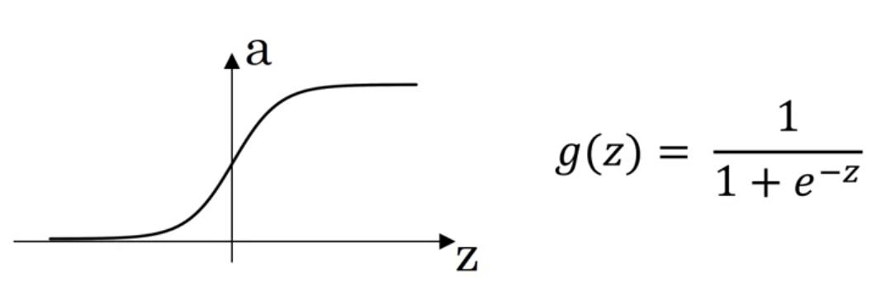

```plain
a = g(z) = 1 / (1 + e^(-z))
g'(z) =g(z) * (1 - g(z)) = a * (1 - a) 
```

### Tanh Activation Function
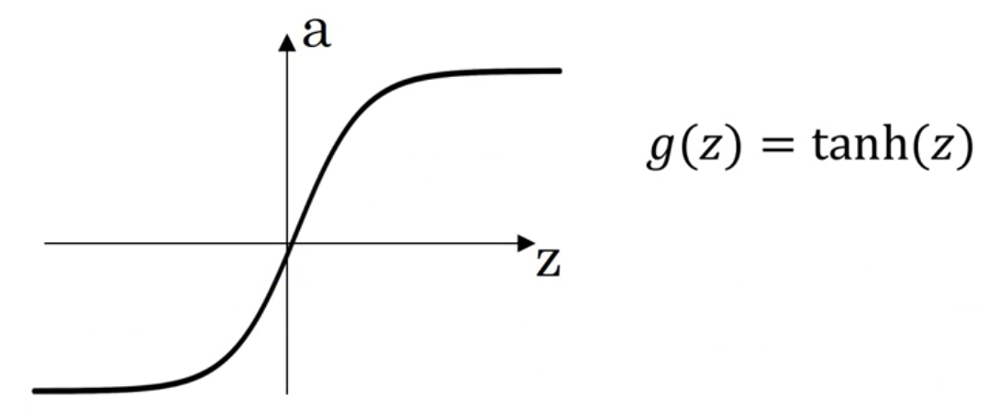

```plain
a = g(z) = tanh(z) = (e^z - e^(-z)) / (e^z + e^(-z))
g'(z) = 1 - (tanh(z))^2 = 1 - a^2
```

当初始w非常大时，z也非常大，斜率接近于0

### ReLU and Leaky ReLU
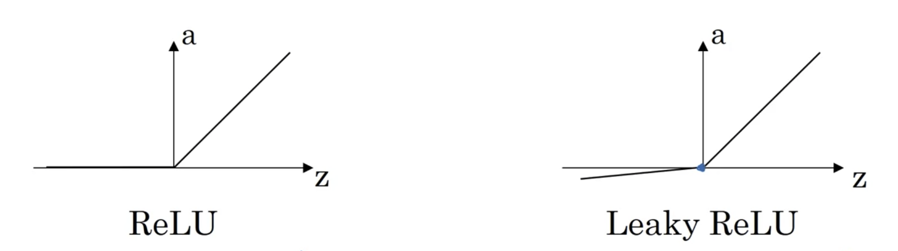

```plain
g(z) = max(0, z)
g'(z) = 0 if  z < 0 else 1
```

### Gradient Descent for Neural Networks
假设神经网络只有一个隐藏层（2 layer nn），且有参数 w^[1]，b^[1]，w^[2]，b^[2]

那么cost function J(w^[1]，b^[1]，w^[2]，b^[2]) = 1 / m sum L(yhat, y) ，其中yhat = a^[2] 即output layer的结果

然后梯度下降，通过求导得到参数的变化

### Random Initialization
如果将参数初始化为0，那么两个隐藏单元的结果相同，无论迭代多少次，这两个隐藏单元都会得到相同的结果。

因此只有随机初始化能解决这个问题。

```python
def initialize_parameters(n_x, n_h, n_y):
    """
    Argument:
    n_x -- size of the input layer
    n_h -- size of the hidden layer
    n_y -- size of the output layer
    
    Returns:
    parameters -- python dictionary containing your parameters:
                    W1 -- weight matrix of shape (n_h, n_x)
                    b1 -- bias vector of shape (n_h, 1)
                    W2 -- weight matrix of shape (n_y, n_h)
                    b2 -- bias vector of shape (n_y, 1)
    """
    
    np.random.seed(1)
    
    #(≈ 4 lines of code)
    # W1 = ...
    # b1 = ...
    # W2 = ...
    # b2 = ...
    # YOUR CODE STARTS HERE
    W1 = np.random.randn(n_h, n_x) * 0.01
    b1 = np.zeros(shape=(n_h,1))
    W2 = np.random.randn(n_y, n_h) * 0.01
    b2 = np.zeros(shape=(n_y,1))
    
    # YOUR CODE ENDS HERE
    
    parameters = {"W1": W1,
                  "b1": b1,
                  "W2": W2,
                  "b2": b2}
    
    return parameters   
```

乘上 0.01 是为了让初始参数足够小。如果 w 非常大，那么 z 可能是一个非常大或非常小的数，在激活函数上，较大或较小值所在位置的斜率非常小，这就意味着梯度下降会非常缓慢。


## unit 4 
### Deep L-layer Neural Network
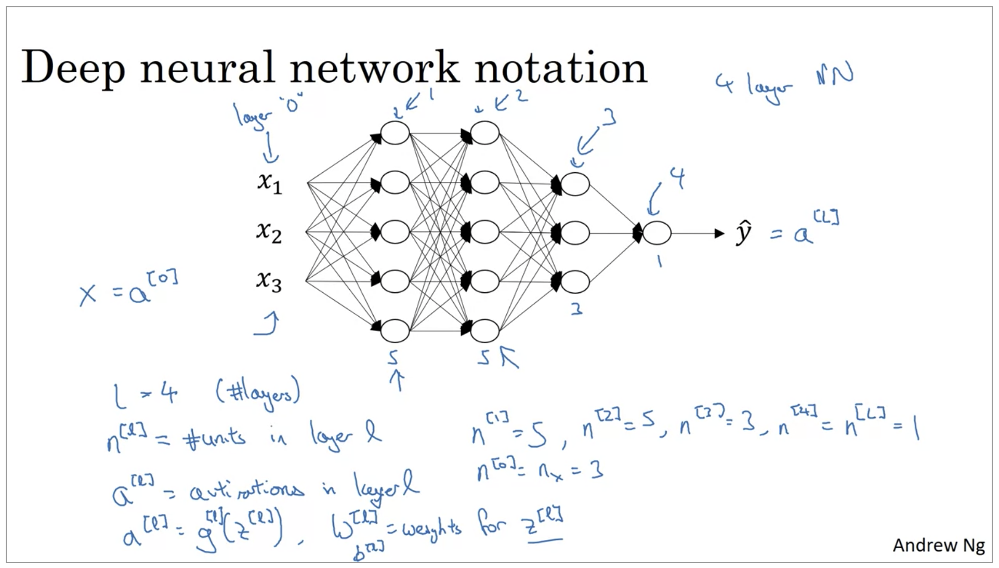

符号说明：

- L：网络总层数

n^[l]：第 l 层的神经元数量

- a^[l]：第 l 层的激活值

### 正向传播 (Forward Propagation)
Z<sup>[l]</sup> = W<sup>[l]</sup>A<sup>[l-1]</sup> + b<sup>[l]</sup>

A<sup>[l]</sup> = g<sup>[l]</sup>(Z<sup>[l]</sup>)

A<sup>[0]</sup> = X

### Matrix Dimentions
x：(n^[0], 1)

W<sup>[l]</sup>: (n<sup>[l]</sup>, n<sup>[l-1]</sup>)

b<sup>[l]</sup>: (n<sup>[l]</sup>, 1<sup></sup>)

dW<sup>[l]</sup>: (n<sup>[l]</sup>, n<sup>[l-1]</sup>)

db<sup>[l]</sup>: (n<sup>[l]</sup>, 1)

在向量化计算中，对于 m 个训练样本，将所有 z (n^[l], 1) 按列堆叠得到 Z (n^[l], m)，b 会被广播为 (n^[l], m)，X 为 (n^[l-1], m)

### 深度神经网络的基本组件 (Building Blocks of Deep Neural Networks)
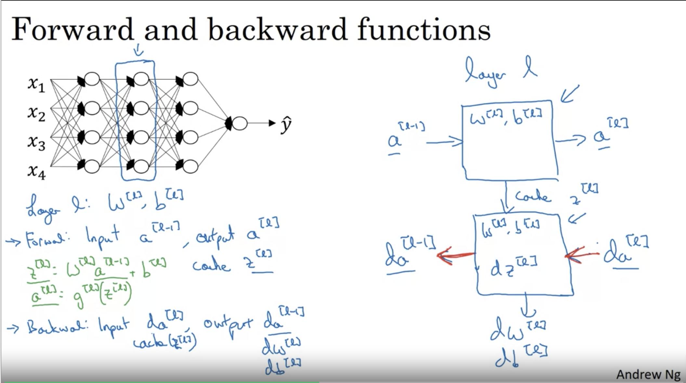

正向传播：通过 a^[l-1] 计算 a^[l]

反向传播：通过 da^[l] 计算 da^[l-1]

每一步正向传播都缓存了 z^[l]

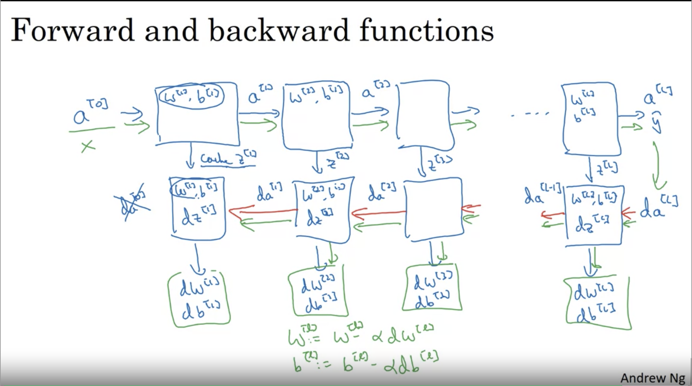

通过 w[l] := w[l] - 学习率*dw[l] 来更新每一层的参数

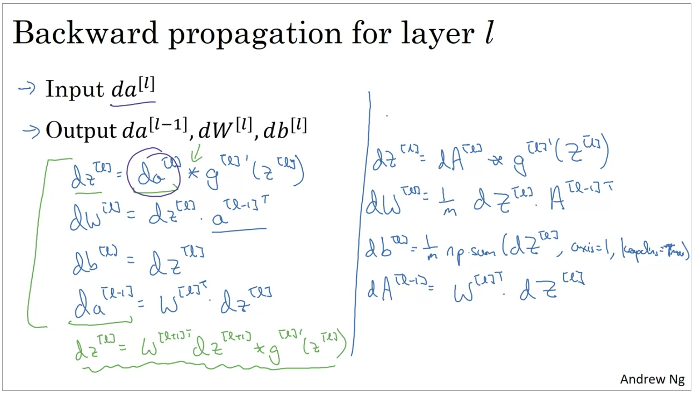


### 参数与超参数 (Parameters vs Hyperparameters)
学习率 alpha、隐藏层数量等都用于控制最终的参数 W 和 B，因此我们称它们为**超参数 (Hyperparameters)**。

超参数决定了 W 和 B 的最终值。

###   

# 深度神经网络的优化：超参数调优、正则化与优化 (Improving Deep Neural Networks)
## 单元1
### 训练集/开发集/测试集 (Train/Dev/Test Sets)
传统划分比例：70%/30% 或 60%/20%/20%（总数据量在 1 万以内）

如今数据规模较大，如 100 万数据，实际只需 1 万作为开发集，即 98%/1%/1%。

工作流程：用训练集训练模型，用开发集（hold-out 交叉验证集）比较不同模型的效果选最优，最后用测试集评估最终模型。


underfitting - high bias ；  overfitting - high variance ； just right


**高方差 (High Variance)/过拟合**：训练集误差低，开发集误差高 → 获取更多训练数据

**高偏差 (High Bias)/欠拟合**：训练集和开发集误差都高 → 尝试更大的网络


### L2 Regularization
通过给损失函数增加一个正则项来减少过拟合：

L2 正则化项是怎么避免过拟合 (Overfitting) 的呢？我们推导一下看看，先求导：

 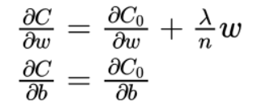

可以发现L2正则化项对b的更新没有影响，但是对于w的更新有影响:

 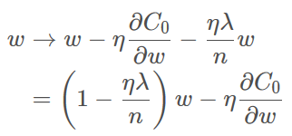

在不使用 L2 正则化时，求导结果中 w 前系数为 1，现在 w 前面系数为 1−ηλ/n，因为 η、λ、n 都是正的，所以 1−ηλ/n 小于 1，效果是减小 w，这也就是**权重衰减 (Weight Decay)**的由来。当然考虑到后面的导数项，w 最终的值可能增大也可能减小。

ref:[https://blog.csdn.net/jialibang/article/details/108991631](https://blog.csdn.net/jialibang/article/details/108991631)

总结一下，如果正则化参数变得非常大，会导致参数 W 很小，那么 Z 就会相对变小。

Z 只在小范围内取值时，若激活函数为 tanh，则函数呈现相对线性。

那么你的整个神经网络就只能计算一些离线性函数很近的值 也就是相对比较简单的函数 ，

而不能计算很复杂的非线性函数，因此就不太容易过拟合了。

要减少高方差（过拟合），需增大正则化参数 lambda

增大正则化参数会减小权重 W 的幅度，从而避免过拟合、降低方差。


### Dropout Regularization
使用随机失活技术 (Dropout)，我们要遍历网络的每一层，为每个节点设置一个丢弃概率。

即对每一层的每个节点作一次公平投币。

使这个节点有 50% 的几率被保留，50% 的几率被丢弃。

抛完硬币后，我们决定消除哪些节点，然后清除那些节点上所有正在进行的运算。

所以你最后得到的是一个更小、更简化的网络。

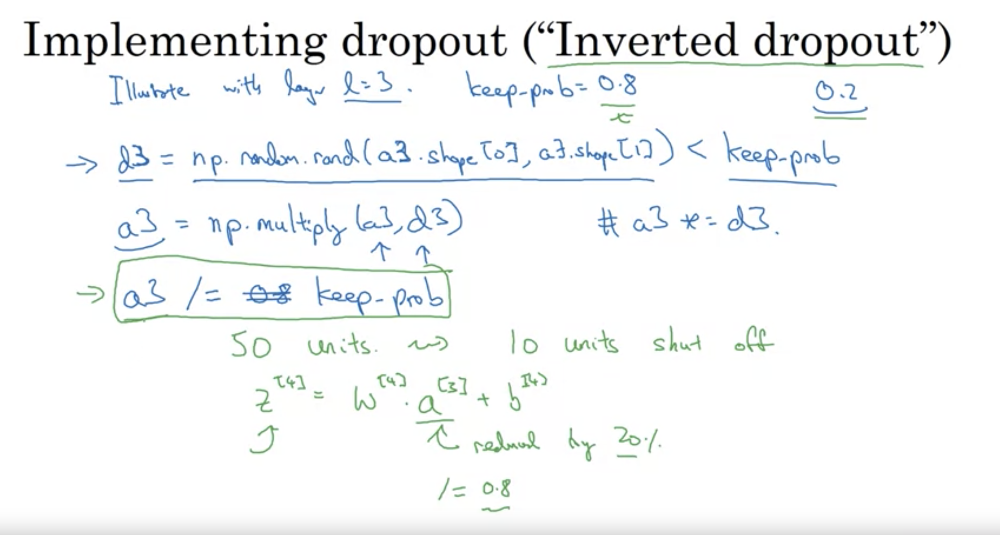

d3 是第 3 层的失活向量 (dropout mask)，形状与 a3 相同。

即keep.prob是一个数值，这个样例中它赋值为0.8 ，

这是给定隐藏单元将被保留的概率值 ，

keep.prob=0.8  ，

d3中的元素都有0.8的几率取值为1，0.2的几率取值为0 ，

然后取层3的激活矩阵，用a3来表示 ，

它是用原来的a3与d3相乘得到的矩阵，这里的相乘是逐元素相乘，也可以写成a3*=d3 ，

通过点乘将a3中0值对应位置的元素一一清零，

最后我们要放大a3，将a3除以keep.prob参数， 

假设层3有50个单元，所以a3的维数是50x1， 

如果你做矢量化的运算，它的维数是50xm， 

所以每个神经元有 80% 的几率被保留，20% 的几率被丢弃。

这意味着平均起来，将有 10 个单元失活或被清零。

现在看看 z4 的值：z4 = w4·a3 + b4

由于 a3 中 20% 的元素被清零，z4 的期望值会减少 20%。为了补偿这一点，需要将 a3 除以 keep_prob（0.8），这样 z4 的期望值保持不变。

这就是反向随机失活技术（inverted dropout technique）——在训练时缩放激活值，使得测试时无需额外处理。


我们可以为不同的layer设置不同的keep.prob，如果设为1，则保留该层的所有单元。


### 其他正则化方法 (Other Regularization Methods)
+ 数据集扩增（data augmentation）

将训练样本旋转、扭曲等，以较小代价获得更多训练样本。

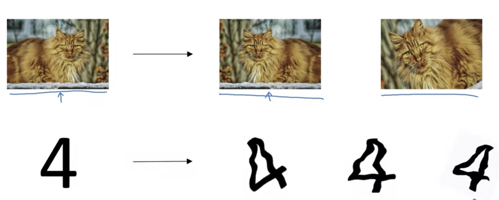

+ Early stopping


### 输入归一化 (Normalizing Inputs)
- 所有输入向量减去均值 μ，使数据以原点为中心。
- 除以方差 σ² 进行归一化，使各特征具有相似的尺度。

如果特征的尺度 (Scale) 相差很大，代价函数的等高线会呈现细长的椭圆形，梯度下降需要更多步数才能收敛。

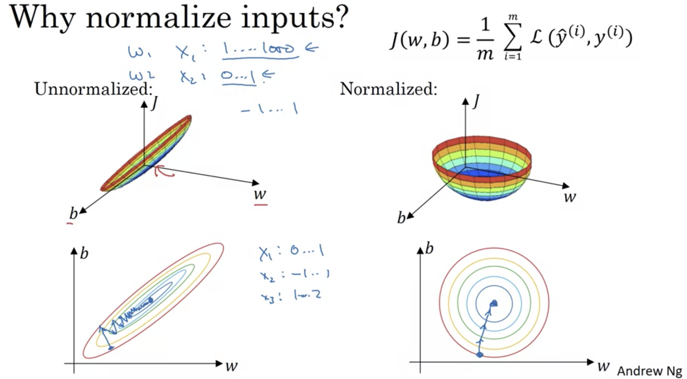


### Vanishing / Exploding Gradients 梯度的消失和爆炸

在深层神经网络中，激活值或梯度会随着层数 L 呈指数级增长或衰减（例如使用线性激活函数 g(z)=z 且权重大于 1 时）。

这会导致训练困难：
- 梯度爆炸：梯度值过大，参数更新不稳定
- 梯度消失：梯度趋近于 0，梯度下降步长极小，学习极其缓慢

**解决方法**：使用合适的权重初始化（如 Xavier/He 初始化）和 ReLU 激活函数。


### 梯度检验 (Gradient Checking)
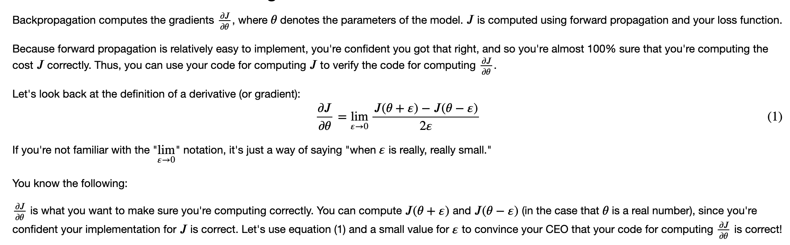

## 单元2
### 小批量梯度下降 (Mini-batch Gradient Descent)
将大训练集划分为小批量（mini-batch），如每批 1000 个样本，分批进行梯度下降。

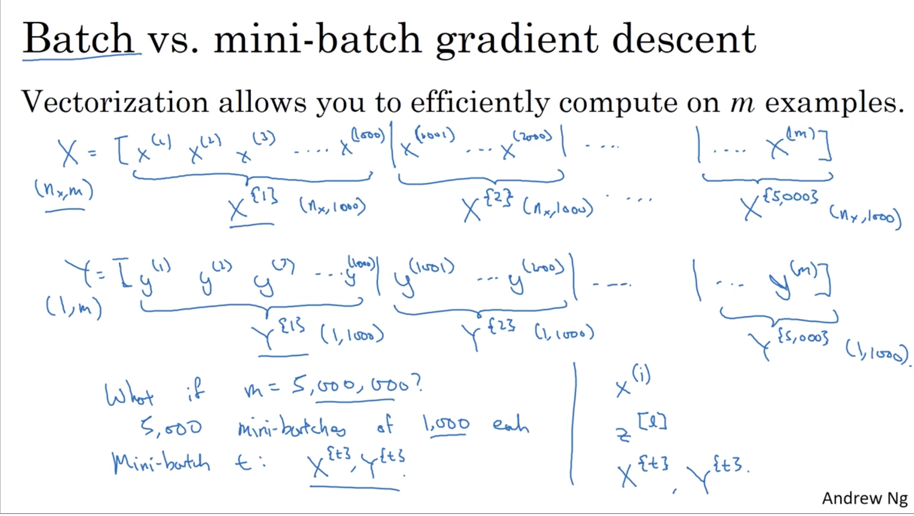

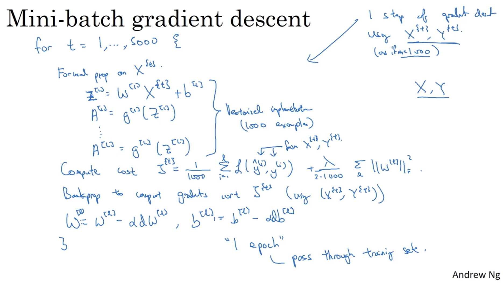

当训练集很大时，小批量梯度下降比批量梯度下降快得多，这是处理大规模数据的标准做法。


训练集较小（≤ 2000）时，直接使用批量梯度下降即可。

如果使用mini-batch graident descent, 一般设置bath size为64, 128, 256, 512，1024，因为计算机内存的布局和访问方式，设置为2的幂会运行的快些。


### 指数加权平均 (Exponentially Weighted Averages)
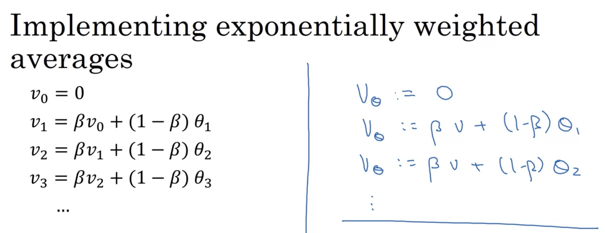

指数加权平均是一种统计技术，通常用于时间序列数据。它基于指数衰减，将较旧的数据赋予较小权重，较新的数据赋予较大权重。该技术用于计算时间序列的平均值，能有效平滑数据，减少噪音和异常值的影响。

将时间序列数据平滑处理，使数据趋于平缓，更容易观察到整体趋势和周期性变化。

假设我们有一个销售数据的时间序列 {10, 12, 14, 16, 18}，其中第一个数字表示第一天的销售量，第二个数字表示第二天的销售量，以此类推。

我们可以使用指数加权平均来平滑这个数据序列。假设我们使用平滑因子 α = 0.5，我们可以通过以下公式来计算每个时间点的指数加权平均值：

y_0 = 0

y_1 = αx_1 + (1-α)y_0 = 0.5 * 10 + 0.5 * 0 = 5

y_2 = αx_2 + (1-α)y_1 = 0.5 * 12 + 0.5 * 5 = 8.5

y_3 = αx_3 + (1-α)y_2 = 0.5 * 14 + 0.5 * 8.5 = 11.25

y_4 = αx_4 + (1-α)y_3 = 0.5 * 16 + 0.5 * 11.25 = 13.625

y_5 = αx_5 + (1-α)y_4 = 0.5 * 18 + 0.5 * 13.625 = 15.8125

因此，我们得到了一个平滑的数据序列 {5, 8.5, 11.25, 13.625, 15.8125}。可以看到，随着时间的推移，较旧的数据点所占的权重逐渐降低，较新的数据点所占的权重逐渐增加，从而使得序列更平滑，更容易观察到趋势。

### 指数加权平均的偏差校正 (Bias Correction)
  
在指数加权平均中，由于较早的数据点权重较小，因此在开始时可能会有较大偏差 (Bias)。为了解决这个问题，可以使用偏差校正 (Bias Correction) 来修正这个偏差，使得指数加权平均更加准确。

具体而言，偏差校正通常是在指数加权平均公式的分母中添加一个校正因子，以减少初始时的偏差。

v_t = (1 - β^t) / (1 - β)

其中，v_t 是校正因子，β 是平滑因子，t 是时间步。校正因子 v_t 表示 t 时刻时权重的平均值，可以看作是一个调整因子，用于修正指数加权平均的偏差。

通过偏差校正，可以更准确地计算指数加权平均，从而更好地反映数据的整体趋势和变化。

y_1 = αx_1 + (1-α)y_0 / (1-α) = 0.5 * 10 + 0.5 * 0 / (1-0.5) = 10

y_2 = αx_2 + (1-α)y_1 / (1-α^2) = 0.5 * 12 + 0.5 * 10 / (1-0.5^2) = 11.2


### 带动量的梯度下降 (Gradient Descent with Momentum)
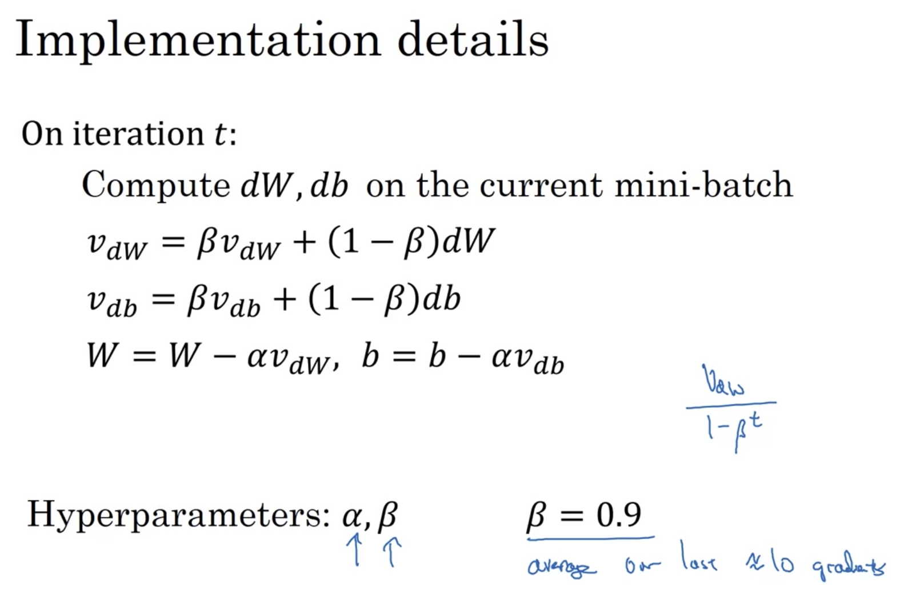

Beta 越大，梯度下降曲线越平滑。

### RMSprop（均方根传递，Root Mean Square Propagation）
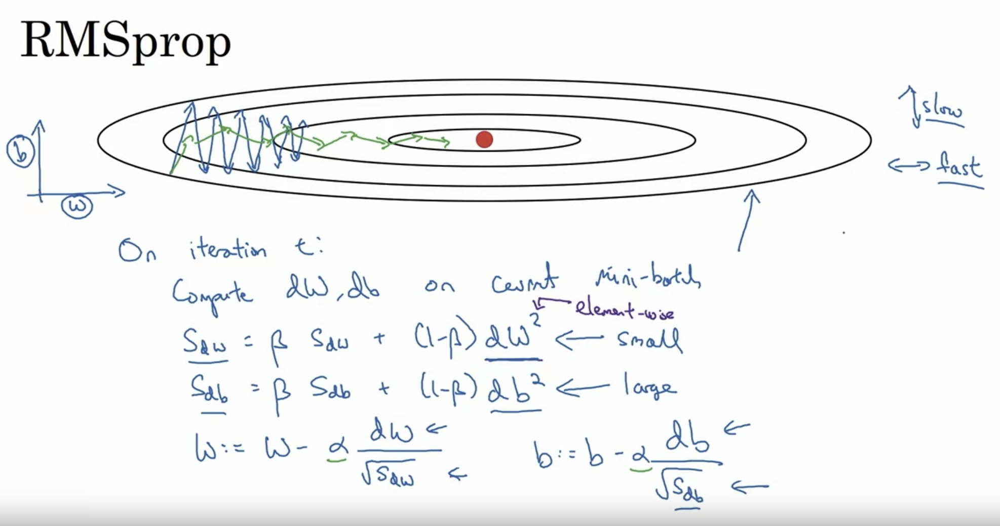

更新参数时，减去 dw (db) 除以平方根，以减小震荡。

平方根项通常会加上 epsilon (10⁻⁸) 防止分母过小。

### Adam 优化算法 (Adam Optimization)
Adam = Momentum + RMSprop，全称 **A**daptive **M**oment **E**stimation。

- Momentum 保留梯度的指数加权平均（一阶矩）
- RMSprop 保留梯度平方的指数加权平均（二阶矩）
- 结合两者的优势，同时使用偏差校正

通常是最优的优化器选择，可作为默认使用。

### 学习率衰减 (Learning Rate Decay)

随着训练接近收敛，缓慢减小学习率，使步长变小，避免在最优值附近震荡。

常用公式：α = α₀ / (1 + decay_rate × epoch)


## 单元3
**随机搜索**比网格搜索更高效——在超参数空间中随机抽样，找到较优区域后再进行更密集的搜索。

合适的抽样尺度很重要：

- 学习率 α（0.0001 ~ 1）：不适合用线性尺度均匀采样。应使用对数尺度（log scale），在 10⁻⁴ ~ 10⁰ 之间均匀取样，使每个数量级获得同等搜索资源。
- 指数加权平均 β（0.9 ~ 0.999）：越接近 0.999，β 的微小变化对结果影响越大。应使用 1-β（0.1 ~ 0.0001）进行对数尺度采样。


**熊猫模式**：精心照料一个模型，微调参数。

- **鱼子酱模式 (Caviar Mode)**：同时训练多个模型，在计算资源充足时使用。


### 批量归一化 (Batch Normalization)
批量归一化 (Batch Norm, BN) 作用于 z 到 a 的计算中，在深度学习框架中只需一行代码。

它可以使每个隐藏层的输出具有相似的分布，从而加速模型收敛。

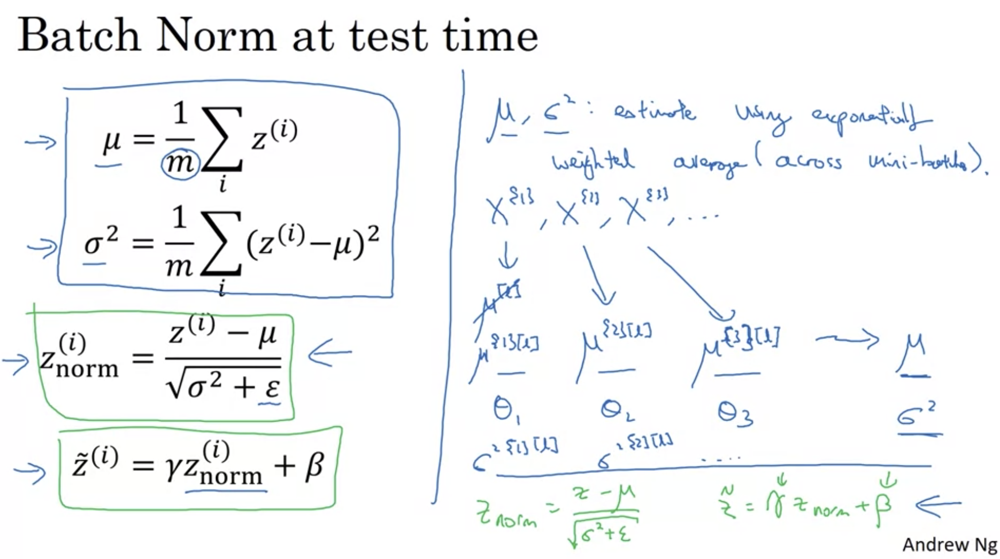

注意，这里省略了层号'l'。

BN 需要计算均值和方差，

但如果只有一个样本，计算其均值和标准差是不合理的。

应通过指数加权平均来估算 mu 和 sigma²。

### 多分类 (Multi-class Classification)
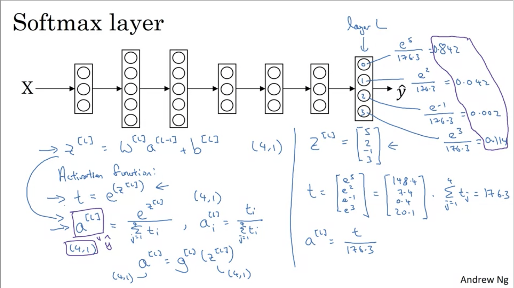

Softmax 激活函数：输入 (4,1)，输出 (4,1)，对结果进行归一化。

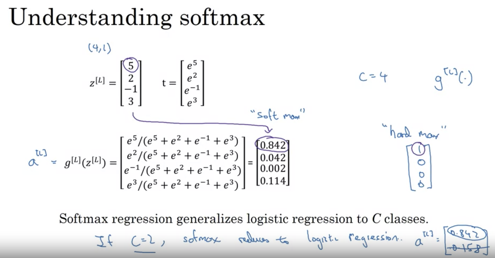

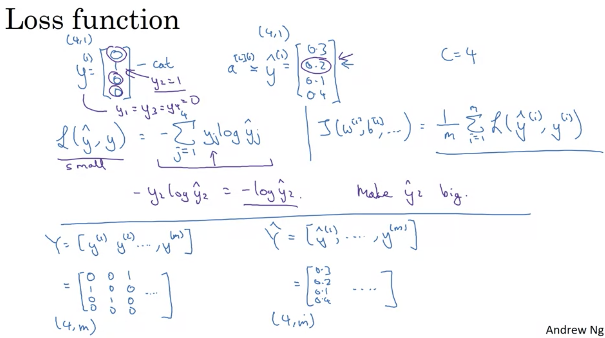

### TensorFlow
TensorFlow 的核心是定义代价函数 (Cost Function)，它能自动反向传播并优化参数。

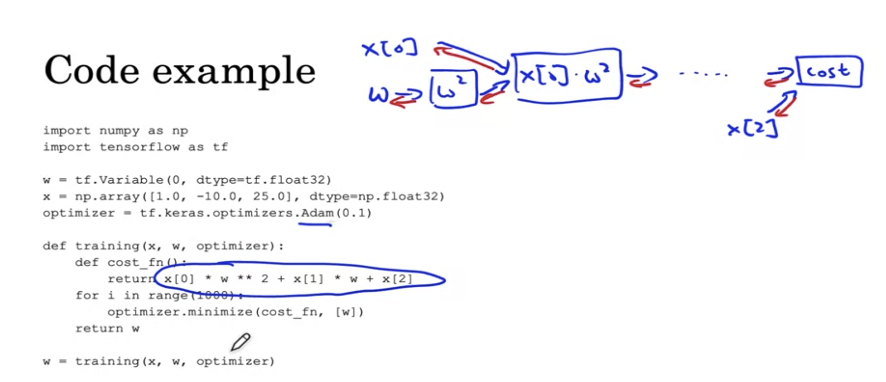

# 机器学习项目的结构 (Structuring Machine Learning Projects)
**精准率 (Precision)**：如果分类器 A 将一张图片分类为猫，那么 95% 可能它就是猫。

**召回率 (Recall)**：如果分类器 A 的召回率是 90%，意味着验证集中的真猫图片，A 正确识别了 90%。

**F1 分数**：精准率 (P) 和召回率 (R) 的调和平均数。


选择的开发集和测试集能够反映出将来预计得到的数据，和你认为重要的数据；打乱所有数据来得到dev set和test set，让它们具有相同的分布。

在早期的机器学习时代，尤其是在数据规模不大的时候，如果你总共只有几百个样例，使用70/30或60/20/20的经验法则是非常合理的，如果你有几千个样例，或者上万个样例，这些比例也是合理的。

但是在现代机器学习中，我们往往需要处理更大量的数据，假如你有100万个训练样例，那么一种合理的做法是 

使用98%的数据作为训练集，1%作为开发集，1%作为测试集。

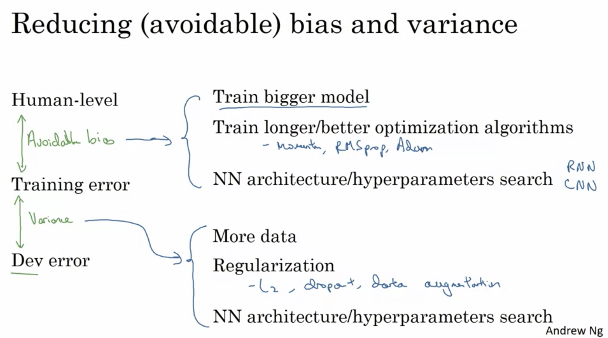

深度学习对随机错误很稳健，只要被错误label(randomly)的数据占比不多，可以忽略它们；对系统误差很敏感，比如把所有的白色的狗都错误标记成猫。


当没有足够的用户真实数据作为训练集时，应在开发集/测试集使用用户真实数据（模型的真实目标），但会导致训练集和开发/测试集的数据分布不一致。


**数据不匹配问题 (Data Mismatch)**：例如训练汽车语音系统时训练数据无噪音，但真实环境有噪音。可通过人工合成（叠加噪音到训练数据）来解决。


如果你有一个小规模的数据集，可以去重新训练最后一层和输出层的神经网络。如果你有大量的数据，可以对所有参数重新训练。这种训练的初始化阶段称为**预训练 (Pre-training)**，即使用图像识别的数据来预初始化神经网络的权重。

之后对所有权重进行更新，在放射扫描数据上的训练称为**微调 (Fine-tuning)**。所以你会在深度学习领域听到"预训练"和"微调"这些词，这就是它们在迁移学习中的含义。

迁移学习适用的条件：

1. 任务 A 和任务 B 有相同的输入
2. 你有更多任务 A 的数据
3. 任务 A 低层的特征能帮助任务 B 达到目标


条件：拥有大量数据时，直接从 x 映射到 y。


# 卷积神经网络 (Convolutional Neural Networks)
对于高清图片（如 1000×1000×3），会有 300 万个特征，即输入 X 的维度为 300 万，计算量极大。在计算机视觉中，我们不想放弃高清图片，为此需要使用卷积神经网络 (CNN)。

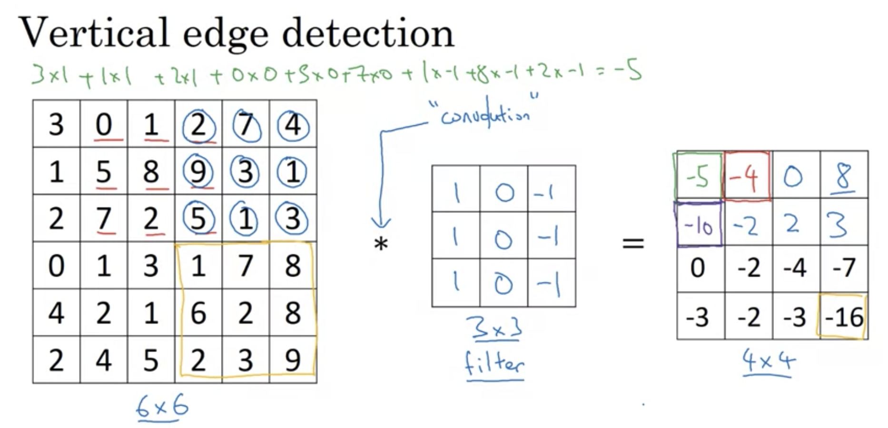

*：卷积运算

计算 6×6×1（灰度）图像的卷积

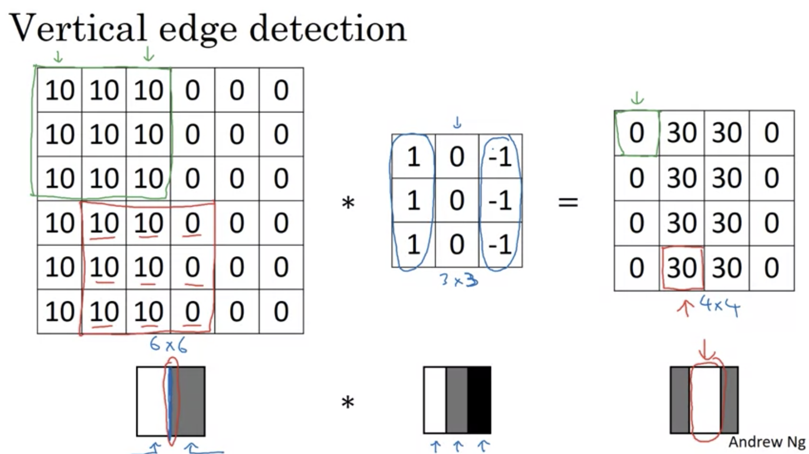

卷积核 (Filter) 中的数字是可调参数，通过反向传播学习得到，而非固定值。

输出尺寸：n×n 矩阵使用 f×f 卷积核，输出为 (n-f+1)×(n-f+1)

缺点：1) 图片尺寸逐层缩小  2) 边界像素只参与一次计算，信息丢失

解决：填充 (Padding) ——给图片加边框。设 p 为填充层数，输出变为 (n+2p-f+1)×(n+2p-f+1)


**Valid 卷积**：不使用 padding

**Same 卷积**：通过 padding 使输出尺寸等于输入尺寸，即 p = (f - 1)/2


**Stride（步长）**：卷积核在输入上滑动的步长。带步长 s 的卷积输出尺寸为 ⌊(n+2p-f)/s⌋+1。

多通道卷积：输入的通道数必须等于卷积核的通道数。卷积核立方体在输入上做卷积，每一步分别对各通道卷积后求和，作为输出的一个值。

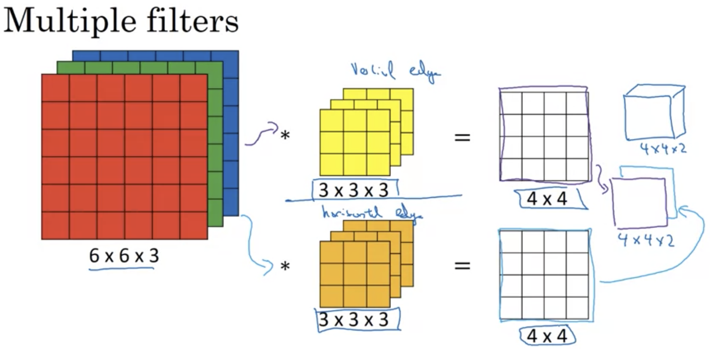

6×6×3 输入与 3×3×3 卷积核相乘 → 4×4×2 输出（使用 2 个卷积核，输出通道数 = 卷积核个数）

通用公式：(n×n×n_c) * (f×f×n_c) → (n-f+1)×(n-f+1)×n_c'

其中 n_c' 是 filter 的个数，即输出通道数。


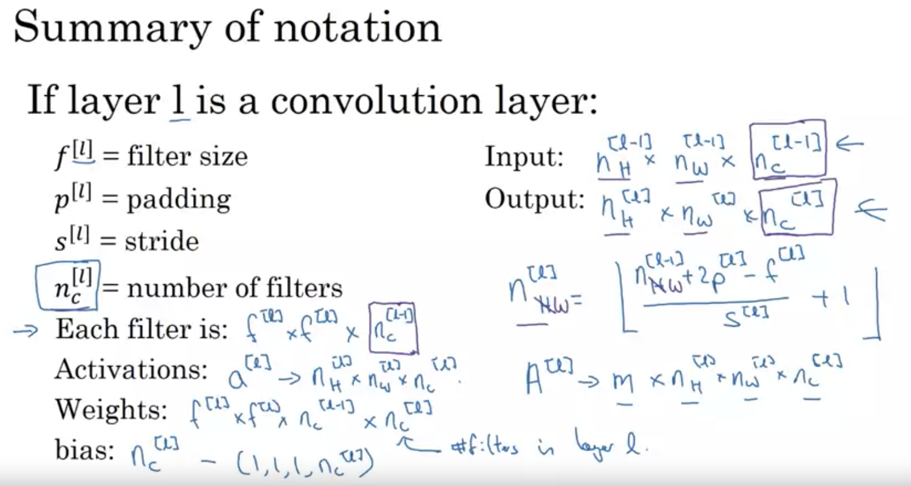

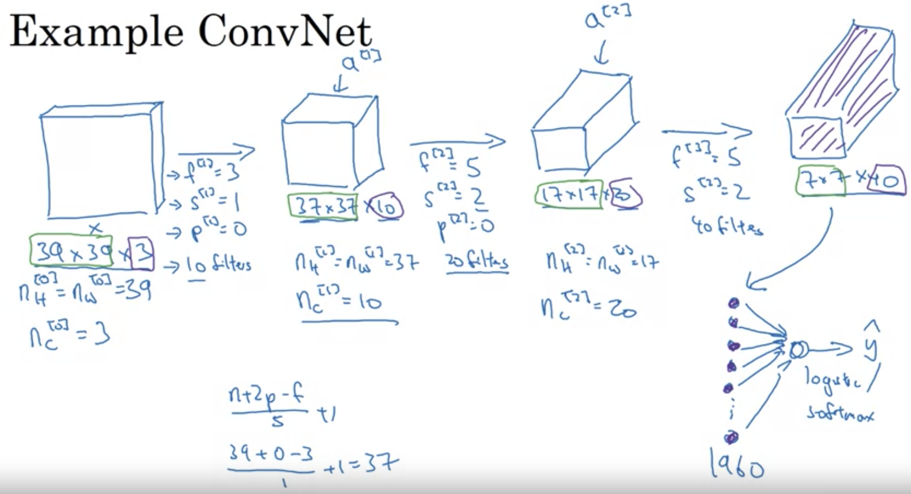


使用池化层（pooling layer）来减少展示量，以此来提高计算速度，并使一些特征的检测功能更强大 ：

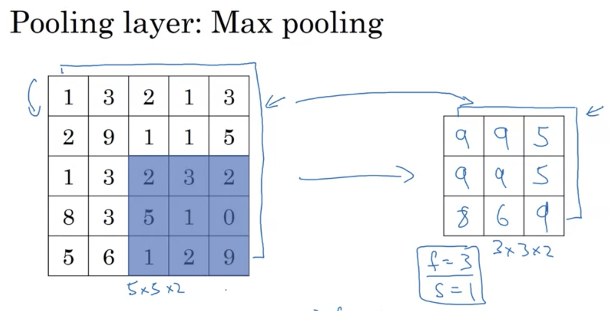

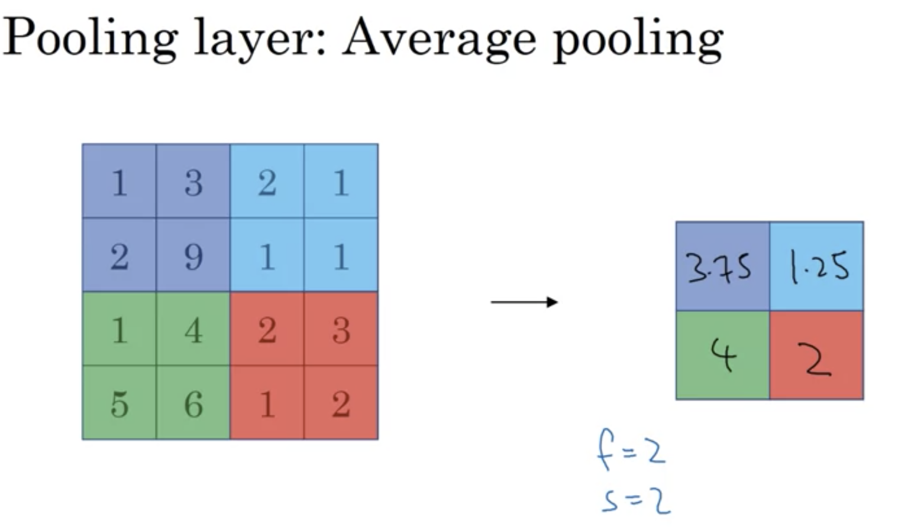

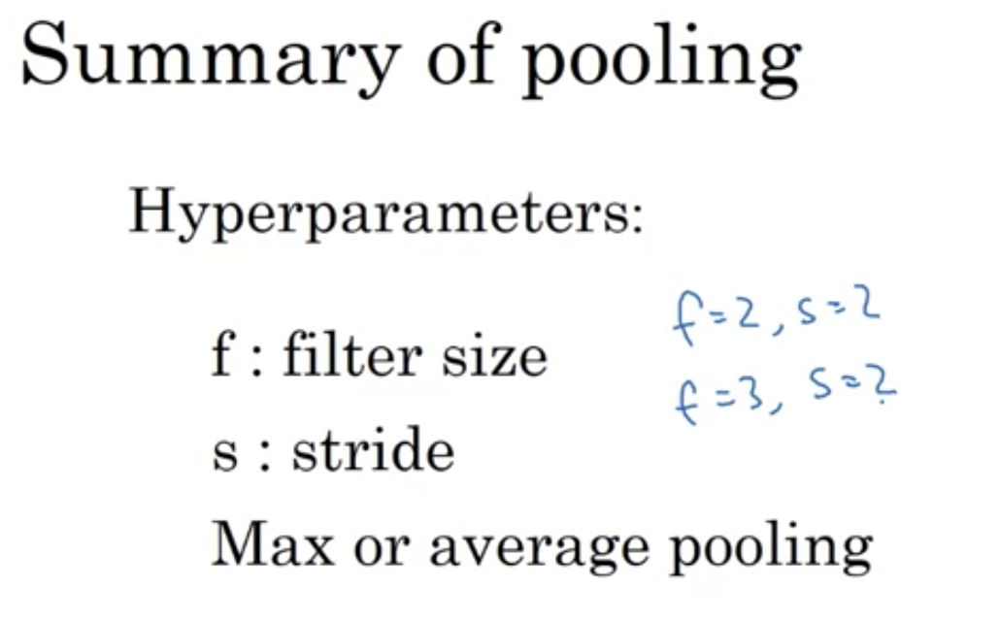

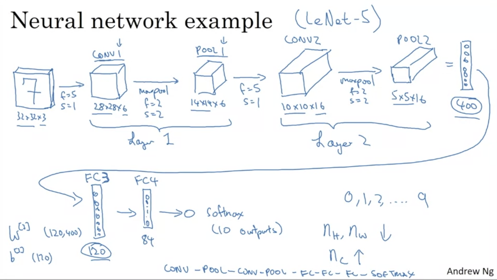

将 CONV + POOL 组合称为一层（如 CONV1+POOL1 → Layer 1）

**Pooling 层**：减少空间维度，提高计算速度，增强特征检测的鲁棒性。
- Max pooling：取窗口内最大值，保留最显著特征
- Average pooling：取窗口内平均值

Pooling 没有可学习参数，窗口大小和步长是超参数。

---

### ResNet 残差网络

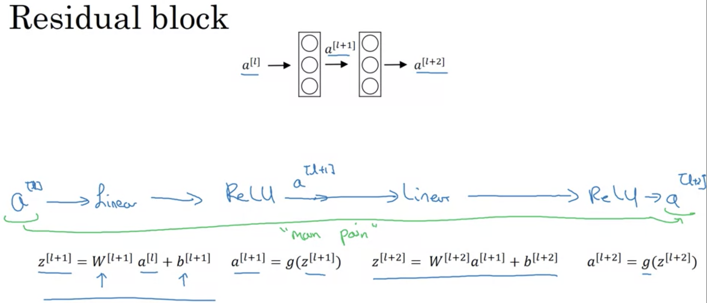

**Skip connection（捷径连接）**：将 a^[l] 直接加到后面某层的输出上，跳过中间若干层。

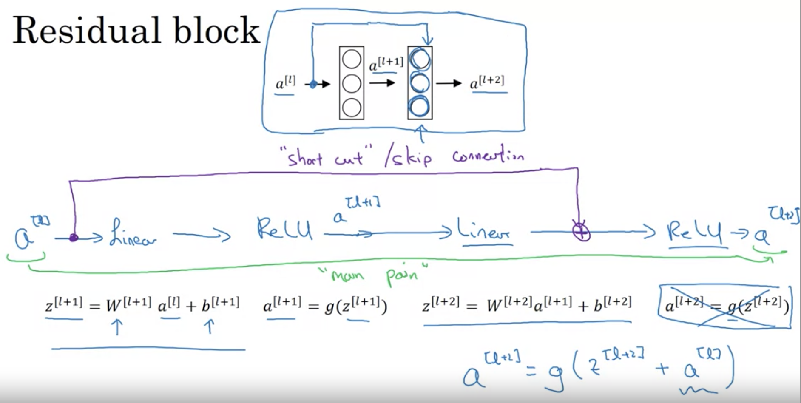

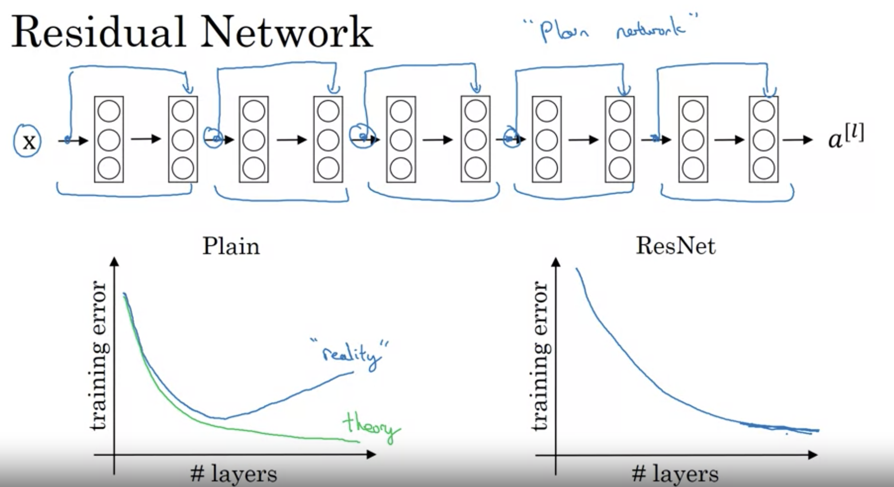

Skip connection 使网络能够学习恒等映射 (Identity Mapping)，解决了深层网络的退化问题：普通网络 (Plain Network) 层数加深后准确率反而下降，而 ResNet 层数越深表现越好。


### MobileNet

将标准卷积分解为 **逐通道卷积 (Depthwise Convolution)** + **逐点卷积 (Pointwise Convolution, 1×1 卷积)**，大幅降低计算量。

### Data Augmentation 数据增强

- 图片翻转、裁剪
- 色彩调节（调整亮度、对比度等）
- 图片失真（旋转、缩放、扭曲）

### YOLO (You Only Look Once)

目标检测算法。将图片划分为 S×S 网格，每个网格预测一个向量 [Pc, bx, by, bh, bw, c₁, c₂, c₃]：
- Pc：是否有物体的置信度
- bx, by：物体中心相对于当前网格的偏移
- bh, bw：框的宽高
- c₁~c₃：物体类别概率


Intersection over union

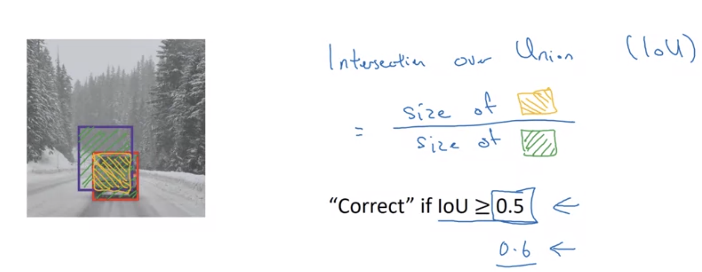


### Non-Max Suppression（非极大值抑制）

对重叠的预测框，只保留 IoU（交并比，Intersection over Union）最高的一个，去除冗余检测。


Anchor boxes

解决同一网格单元 (Grid Cell) 中有多个物体中心的问题。例如设置 2 个锚框 (Anchor Box)，则 3×3×8 变为 3×3×16。


语义分割

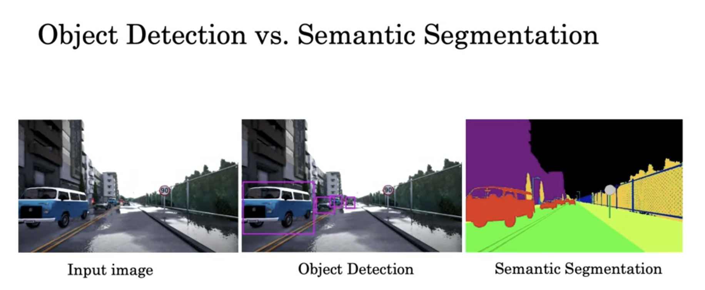

将每个像素分类为目标类别。通过 Transposed Convolution（转置卷积）将低维特征图上采样回原图尺寸。

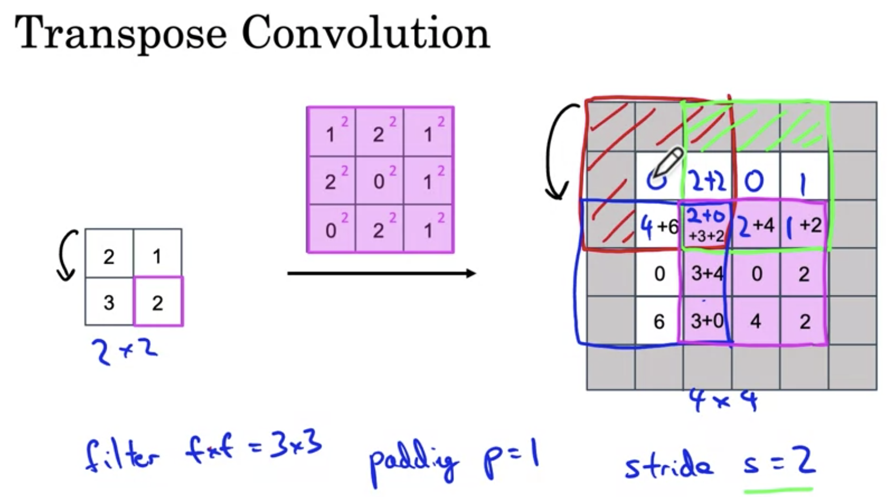

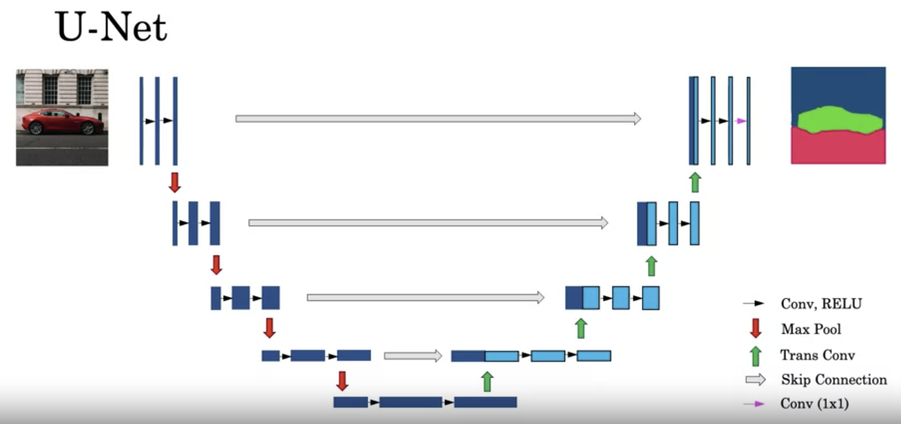


### One-Shot Learning

学习相似度函数，判断两张图是否为同一人或物。


### Triplet Loss

Anchor(A), Positive(P), Negative(N)

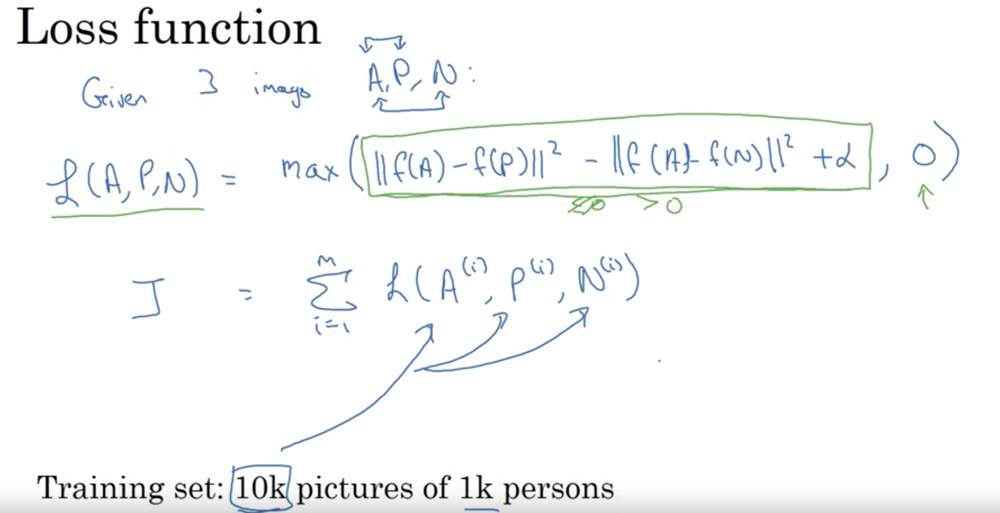

目标：使同一个人 (A, P) 的编码距离小于不同人 (A, N) 的距离，加上边界值 margin α。

L(A, P, N) = max(||f(A) - f(P)||² - ||f(A) - f(N)||² + α, 0)

