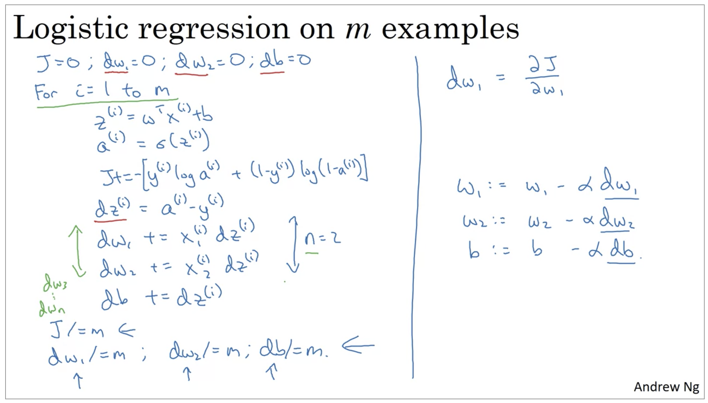
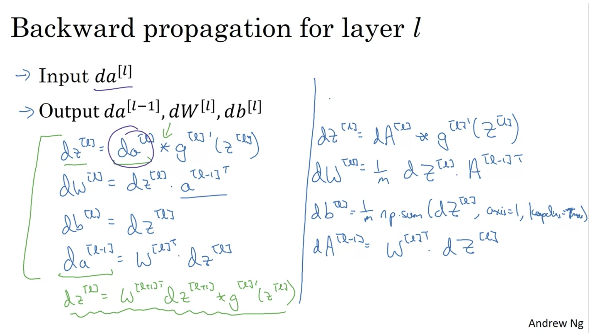
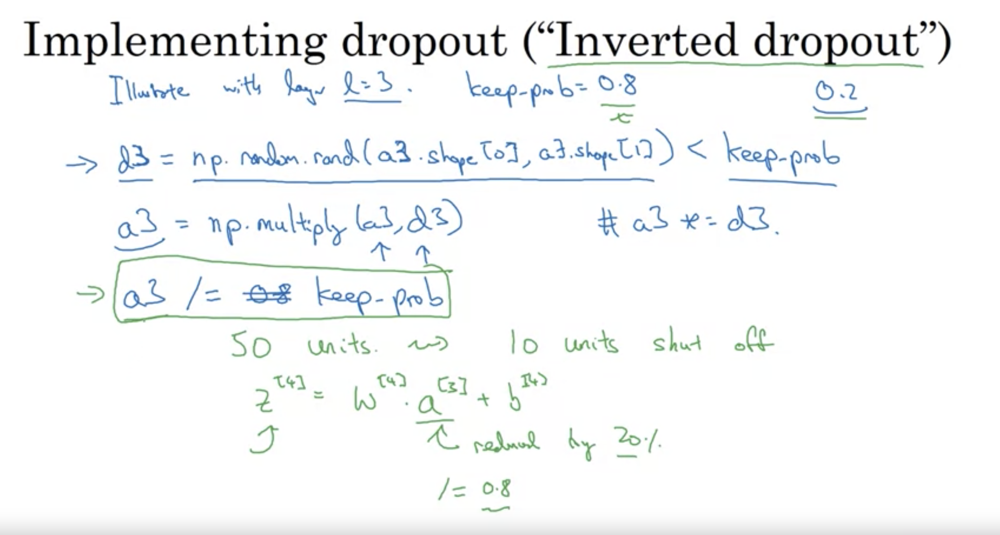

# Neural Nework and Deep Learning
## unit 1
### **ReLu Function**: 线性整流函数 (Rectified Linear Unite) 


### 输入层、隐藏层


左边的x1,x2,x3,x4是**输入层**

中间的三个神经元是**隐藏层**，隐藏层是全连接的，隐藏层的node会take所有的feature。


### **卷积神经网络与循环神经网络**
convolutional neural network: **卷积神经网络** （for image）- 处理图像 - 监督学习

recurrent neural network: **循环神经网络** (for sequence data) - 处理序列化数据 - 监督学习

**结构化数据** Structured Data: databases

**非结构化数据** Unstructured Data: audio, images, text


### 深度学习怎么行的
Scale drives deep learning progress: **labeled data scale + neural network scale**

New **algorithms**

**Computation** - GPUs 


## unit 2
### How computer stores a picture
stores three separate matrices corresponding to Red, Green, Blue;

if the image is 64 pixels by 64 pixels, then it has three 64x64 matrices corresponding to Red, Green, Blue pixel intensity value.

将所有矩阵展开得到一个特征向量 -  unroll(展开) all matrices to a feature vector (one-d arry) as x， 则x是一个长度为 64x64x3=12288 的一维向量。


### 符号表示
一个单独的training example用一个pair表示: (x, y),  x∈R<sup>nx</sup> （n<sub>x</sub>维度的特征向量）， y∈{0, 1}

使用n或n<sub>x</sub>来表示X的维度

使用m或m<sub>train</sub>来表示训练集合: {(x<sup>(1)</sup>, y<sup>(1)</sup>), (x<sup>(2)</sup>, y<sup>(2)</sup>), ..., (x<sup>(m)</sup>, y<sup>(m)</sup>)}

使用m<sub>test</sub>来表示测试集合

将x<sup>(1)</sup> 放在X矩阵的第一列，x<sup>(2)</sup>放在X矩阵的第二列。。。那么将得到一个 m列（训练样本个数）、n<sub>x</sub> 行（特征数）的二维矩阵X。

X∈R<sup>nx x m</sup>, X.shape = (nx, m)

Y = [y<sup>(1) </sup> , y<sup>(2)</sup> , ... y<sup>(m) </sup> ], Y.shape = (1, m)


### Logistic Regression
a Binary Classification Algorithm,  label Y ∈ {0, 1}

**逻辑回归**是一个二分类算法


yhat: given x，y=1的概率 - 表示对真实标签Y的估计 - 概率范围[0,1]

参数：w: nx维度，b: real number实数

使用yhat = w<sup>t</sup>x+b(linear regression线性回归)处理二分类问题是不合理的，因为它的输出可能是负数也可能大于1.

设z=w<sup>t</sup>x+b，使用sigmoid(z)函数来表示yhat

z越大，s(z)越接近1；z越小，s(z)越接近0


### loss function 损失函数 and cost function 代价函数


**Loss(error) function**: define to measure how good our output yhat is when the true label is y.

loss function损失函数：仅用于单独的训练样本 

在逻辑回归中，如果使用 L=1/2(yhat - y)<sup>2</sup>  （squared error）作为loss function，会无法找到 global optimum, 从而无法convex。

所以需要使用另一个公式定义loss function，which更容易找到全局最优。

L = -(ylogyhat + (1-y)log(1-yhat))

当y=1时，L = -logyhat，希望yhat更大（更接近1），即logyhat更大 -> L更小

当y=0时，L = -log(1-yhat)，希望yhat更小（更接近0），即log(1-yhat)更大 -> L更小


**cost function**: 整个训练集的平均loss 

cost function is cost of the parameters W and B, 要找到最合适的para最小化cost.

### Graident Descent


horizontal axies: w and b

vertical axies: cost function (J)

suppose w and b are both singular number单一实数:

In each iteration, graident descent takes a step downhill in the direction of steepest descent or  as quickly down as possible, and finally converge to the global optimum or close to the global optimum.


为了方便画图，先去掉参数b； 使用 “:=” 来表示持续更新

w := w - a(dw)

alpha: learning rate 学习率，控制每个step的大小for each iteration 

derivative(导数)=slope of a function（函数的斜率）；这里表示对参数w的更新，我们用dw来表示图中这个导数

假设现在w在图中最右边的点，那么导数是正数，w就会变小（减去 alpha * dw），即向左移动；同理若w在最左边的点，那么dw是正数，w就会增加。

同理我们对参数b也使用这个式子进行梯度下降。


### Computation Graph 计算图
foward propagation: 正向传播 - 计算神经网络的输出

backward propagation: 反向传播 - 计算梯度或微分

chain rule：链式（求导）法则

在python写代码时，我们用 'dvar' 来表示最终对var求导的结果.（dJ/dvar简化为dvar）


### Logistic Regression Gradient Descent


对于单一样本，假设我们只有2个特征x1, x2, 目标是调整w1, w2, b 来减小 Loss function


通过反向传播和链式法则，首先算出"da"，再算出"dz"为a-y，再算出dw1, dw2，最终得到w1,w2的更新函数。


为了在m个样本下cost function - J(w, b)，需要求所有样本的loss总和的平均值.

此情况下求dw1，需要在对每个individual loss求dw1，求和取平均



得到参数的偏导数后，对参数进行更新，实现一次梯度下降

这种方法的缺点是存在两重循环，在数据集大、feature数量大时计算效率低。

### Vectorizaton 向量化
vectorization（向量化）technique可以去除这些for-loops，这在现代深度学习非常重要。

两个向量a = [a1, a2,…, an]和b = [b1, b2,…, bn]的点积定义为：

a·b=a1b1+a2b2+……+anbn。

使用np.dot会非常快

Simple example:

import numpy as np  
import time  
a = np.random.rand(1000000)  
b = np.random.rand(1000000)  
  
tic = time.time()  
c = np.dot(a, b)  
toc = time.time()  
print("Vectorized time: " + str(1000 * (toc - tic)) + "ms")  
  
c = 0  
tic = time.time()  
for i in range(1000000):  
    c += a[i] * b[i]  
toc = time.time()  
print("For loop time: " + str(1000 * (toc - tic)) + "ms")  


Vectorized time: 4.040956497192383ms  
For loop time: 406.5101146697998ms

使用向量化计算神经网络向前传播 - 根据输入训练样本计算预测值A:


预测向量 A = [a1 a2 ... a^m] = sig(Z)

真实向量 Y = [y1 y2 ... y^m]

通过反向传播, 向量dz = A - Y 

向量dw = [x1dz1 x2dz2 .. xmdzm]

向量db = [dz1 dz2 ... dzm]

再除以样本总数m，得到w和b的导数，对参数进行更新


使用向量化优化逻辑回归cost function的计算：


在完全不使用for-loop的情况下，完成一次梯度下降。


```python
Useful Functions
def basic_sigmoid(x):
    """
    Compute sigmoid of x.

    Arguments:
    x -- A scalar

    Return:
    s -- sigmoid(x)
    """
    # (≈ 1 line of code)
    # s = 
    # YOUR CODE STARTS HERE
    s = 1 / (1 + math.exp(-x))

    # YOUR CODE ENDS HERE

    return s

# GRADED FUNCTION: sigmoid

def sigmoid(x):
    """
    Compute the sigmoid of x

    Arguments:
    x -- A scalar or numpy array of any size

    Return:
    s -- sigmoid(x)
    """

    # (≈ 1 line of code)
    # s = 
    # YOUR CODE STARTS HERE
    s = 1 / (1 + np.exp(-x))

    # YOUR CODE ENDS HERE

    return s

# GRADED FUNCTION: sigmoid_derivative

def sigmoid_derivative(x):
    """
    Compute the gradient (also called the slope or derivative) of the sigmoid function with respect to its input x.
    You can store the output of the sigmoid function into variables and then use it to calculate the gradient.
    
    Arguments:
    x -- A scalar or numpy array

    Return:
    ds -- Your computed gradient.
    """

    #(≈ 2 lines of code)
    # s = 
    # ds = 
    # YOUR CODE STARTS HERE
    s = sigmoid(x)
    ds = s * (1 - s)

    # YOUR CODE ENDS HERE

    return ds

# GRADED FUNCTION:image2vector

def image2vector(image):
    """
    Argument:
    image -- a numpy array of shape (length, height, depth)
    
    Returns:
    v -- a vector of shape (length*height*depth, 1)
    """

    # (≈ 1 line of code)
    # v =
    # YOUR CODE STARTS HERE
    v = image.reshape((image.shape[0] * image.shape[1] * image.shape[2], 1))

    # YOUR CODE ENDS HERE

    return v

# GRADED FUNCTION: normalize_rows

def normalize_rows(x):
    """
    Implement a function that normalizes each row of the matrix x (to have unit length).
    
    Argument:
    x -- A numpy matrix of shape (n, m)
    
    Returns:
    x -- The normalized (by row) numpy matrix. You are allowed to modify x.
    """

    #(≈ 2 lines of code)
    # Compute x_norm as the norm 2 of x. Use np.linalg.norm(..., ord = 2, axis = ..., keepdims = True)
    # x_norm =
    # Divide x by its norm.
    # x =
    # YOUR CODE STARTS HERE
    x = x / np.linalg.norm(x, axis=1, keepdims=True)

    # YOUR CODE ENDS HERE

    return x

# GRADED FUNCTION: softmax

def softmax(x):
    """Calculates the softmax for each row of the input x.

    Your code should work for a row vector and also for matrices of shape (m,n).

    Argument:
    x -- A numpy matrix of shape (m,n)

    Returns:
    s -- A numpy matrix equal to the softmax of x, of shape (m,n)
    """

    #(≈ 3 lines of code)
    # Apply exp() element-wise to x. Use np.exp(...).
    # x_exp = ...

    # Create a vector x_sum that sums each row of x_exp. Use np.sum(..., axis = 1, keepdims = True).
    # x_sum = ...

    # Compute softmax(x) by dividing x_exp by x_sum. It should automatically use numpy broadcasting.
    # s = ...

    # YOUR CODE STARTS HERE
    x_exp = np.exp(x)
    x_sum = np.sum(x_exp, axis = 1, keepdims = True)
    s = x_exp / x_sum

    # YOUR CODE ENDS HERE

    return s

# GRADED FUNCTION: L1

    def L1(yhat, y):
    """
    Arguments:
    yhat -- vector of size m (predicted labels)
    y -- vector of size m (true labels)

    Returns:
    loss -- the value of the L1 loss function defined above
    """

    #(≈ 1 line of code)
    # loss = 
    # YOUR CODE STARTS HERE
    loss = np.sum(abs(y - yhat))

    # YOUR CODE ENDS HERE

    return loss

# GRADED FUNCTION: L2

    def L2(yhat, y):
    """
    Arguments:
    yhat -- vector of size m (predicted labels)
    y -- vector of size m (true labels)

    Returns:
    loss -- the value of the L2 loss function defined above
    """

    #(≈ 1 line of code)
    # loss = ...
    # YOUR CODE STARTS HERE
    d = y - yhat
    loss = np.sum(np.dot(d,d))

    # YOUR CODE ENDS HERE

    return loss
```

## unit 3
### Neural Networks


Input layer 输入层

hidden layer 隐藏层：中间层的实际值是看不到的，所以称为“隐藏”

output layer 输出层

a^[0] 表示第0个输入层

a上标[1]下标1表示第1层生成的第一个节点

w是列向量，w^T是行向量

图中的神经网络称为“2 layer NN”，因为按照惯例，不把输入层作为正式的一层


x1, x2, x3 组成特征列向量 shape=(3,1)

w1^[1]T, w2^[1]T, w3^[1]T, w4^[1]T 组成参数矩阵 shape=(4,3)

b1^[1]，b2^[1]，b3^[1]，b4^[1] 组成参数列向量 shape=(4,1)

神经网络的隐藏层节点做了和逻辑回归类似的计算，我们可以将节点堆叠起来（变成矩阵）进行向量化计算。


### Activation function 激活函数
之前我们使用的激活函数是sigmoid函数，有一种更优越的激活函数是 tangent function（正切函数） 或 hyperbolic tangent function（双曲线正切函数）

正切函数的范围是(-1, -1)，从图形上看，就是sigmoid往下移动（shift）了，这样的好处是隐藏层更接近均值为0，某种程度上使下一层的学习变得更容易了（？）。

因此我们几乎再也不使用sigmoid作为激活函数了，只用当我们处理二分类（binary classification）问题时，0<=yhat<=1，我们才使用sigmoid。

另一种在机器学习中非常流行的选择是所谓的整流线性单元(ReLU)，公式是 a = max(0,z)，当z为负数时，导数就是0；当z为正数时，导数就是1。

当不知道使用什么激活函数时，一般使用ReLU。还有一种叫做Leaky ReLU （a = max(0.01,z)）的激活函数，不同于ReLU，当z为负数时，会呈现slight的斜率（导数）。总之，选哪种ReLU都可以，它主要的优势是斜率与0相差很大，因此使用ReLU时，神经网络通常学习得更快，主要原因是函数斜率趋于零的影响较小，这会减慢学习速度。

普遍的建议是，如果您不确定这些激活函数中哪一个最有效，请尝试所有这些。

### Why do you need Non-Linear Activation Functions?
对于线性函数而言，隐藏层是无用的，因为两个线性函数的组合仍是线性函数。

但线性函数并不是无用的，可以用于回归问题，如房价预测。

### Sigmoid Activation Function


```plain
a = g(z) = 1 / (1 + e^(-z))
g'(z) =g(z) * (1 - g(z)) = a * (1 - a) 
```

### Tanh Activation Function


```plain
a = g(z) = tanh(z) = (e^z - e^(-z)) / (e^z + e^(-z))
g'(z) = 1 - (tanh(z))^2 = 1 - a^2
```

当初始w非常大时，z也非常大，斜率接近于0

### ReLU and Leaky ReLU


```plain
g(z) = max(0, z)
g'(z) = 0 if  z < 0 else 1
```

### Gradient Descent for Neural Networks
假设神经网络只有一个隐藏层（2 layer nn），且有参数 w^[1]，b^[1]，w^[2]，b^[2]

那么cost function J(w^[1]，b^[1]，w^[2]，b^[2]) = 1 / m sum L(yhat, y) ，其中yhat = a^[2] 即output layer的结果

然后梯度下降，通过求导得到参数的变化

### Random Initialization
如果将参数初始化为0，那么两个隐藏单元的结果相同，无论迭代多少次，这两个隐藏单元都会得到相同的结果。

因此只有随机初始化能解决这个问题。

```python
def initialize_parameters(n_x, n_h, n_y):
    """
    Argument:
    n_x -- size of the input layer
    n_h -- size of the hidden layer
    n_y -- size of the output layer
    
    Returns:
    parameters -- python dictionary containing your parameters:
                    W1 -- weight matrix of shape (n_h, n_x)
                    b1 -- bias vector of shape (n_h, 1)
                    W2 -- weight matrix of shape (n_y, n_h)
                    b2 -- bias vector of shape (n_y, 1)
    """
    
    np.random.seed(1)
    
    #(≈ 4 lines of code)
    # W1 = ...
    # b1 = ...
    # W2 = ...
    # b2 = ...
    # YOUR CODE STARTS HERE
    W1 = np.random.randn(n_h, n_x) * 0.01
    b1 = np.zeros(shape=(n_h,1))
    W2 = np.random.randn(n_y, n_h) * 0.01
    b2 = np.zeros(shape=(n_y,1))
    
    # YOUR CODE ENDS HERE
    
    parameters = {"W1": W1,
                  "b1": b1,
                  "W2": W2,
                  "b2": b2}
    
    return parameters   
```

乘上0.01是为了让初始参数足够小，如果w非常大，那么z可能是一个非常大或非常小的数，在激活函数上，较大或较小的值所在位置的斜率非常小，这就意味着梯度下降会非常缓慢。


## unit 4 
### Deep L-layer Neural Network


notations:

L: 层数

n<sup>[l]  </sup>: 第l层的单元数

a<sup>[l]  </sup>: 第l层的激活函数

### Forward Propagation
Z<sup>[l]</sup> = W<sup>[l]</sup>A<sup>[l-1]</sup> + b<sup>[l]</sup>

A<sup>[l]</sup> = g<sup>[l]</sup>(Z<sup>[l]</sup>)

A<sup>[0]</sup> = X

### Matrix Dimentions
x: (n<sup>[0]</sup>, 1)

W<sup>[l]</sup>: (n<sup>[l]</sup>, n<sup>[l-1]</sup>)

b<sup>[l]</sup>: (n<sup>[l]</sup>, 1<sup></sup>)

dW<sup>[l]</sup>: (n<sup>[l]</sup>, n<sup>[l-1]</sup>)

db<sup>[l]</sup>: (n<sup>[l]</sup>, 1)

在向量化计算中，对于m个训练用例，我们将所有z: (n<sup>[l]</sup>, 1) 堆叠起来(每个用例是一列)，得到Z: (n<sup>[l]</sup>, m)，那么b会被broadcast to (n<sup>[l]</sup>, m), X: (n<sup>[l-1]</sup>, m)

### Building Blocks of Deep Neural Networks


正向传播：通过a<sup>[l-1]</sup>计算a<sup>[l]</sup>

反向传播：通过da<sup>[l]</sup>计算da<sup>[l-1] </sup>

每一步正向传播都cache了z<sup>[l] </sup>


通过 w[l] := w[l] - 学习率*dw[l] 来更新每一层的参数




### Parameters vs Hyperparameters
像 alpha 学习率，隐藏层的迭代次数等都是控制 w 和 b 的参数，所以我们称这些东西超级参数， 

超级参数以某种方式确定参数 w 和 b 的最终值。

###   

# Improving Deep Neural Networks: Hyperparameter Tuning, Regularization and Optimization
## unit 1
### Train / Dev / Test sets
传统划分为 70%/30% or 60%/20%/20% （总数据量在1万内）

如今数据规模较大，如有100万数据，实际只需要1万的数据作为dev sets -> 98%/1%/1%

整个工作流程是首先你不停地用训练集来训练你的算法，然后用你的开发集或者说hold-out交叉验证集来测试许多不同的模型里哪一个在开发集上效果最好，当这个过程进行的时间够长之后你可能想评估一下你最终的训练结果，你可以用测试集对结果中最好的模型进行评估。


underfitting - high bias ；  overfitting - high variance ； just right


High Variance偏差: train set error low；dev set error high -> Get more training data

High Bias方差: train/dev set error近似高 -> Try Bigger Network


### L2 Regularization
通过给损失函数增加一个正则项来减少过拟合：

L2正则化项是怎么避免overfitting的呢？我们推导一下看看，先求导：

 

可以发现L2正则化项对b的更新没有影响，但是对于w的更新有影响:

 

在不使用L2正则化时，求导结果中w前系数为1，现在w前面系数为 1−ηλ/n ，因为η、λ、n都是正的，所以 1−ηλ/n小于1，它的效果是减小w，这也就是**权重衰减（weight decay）**的由来。当然考虑到后面的导数项，w最终的值可能增大也可能减小。

ref:[https://blog.csdn.net/jialibang/article/details/108991631](https://blog.csdn.net/jialibang/article/details/108991631)

总结一下，如果正则化变得非常大，导致参数W很小，那么Z就会相对很小 ，

Z会相对变小，即Z只在小范围内取值，那么激活函数如果是tanh的话 ，这个激活函数就会呈现相对线性 ，

那么你的整个神经网络就只能计算一些离线性函数很近的值 也就是相对比较简单的函数 ，

而不能计算很复杂的非线性函数，因此就不大容易过拟合了。

To reduce high variance, the regularization hyperparameter lambda must be increased

By increasing the regularization parameter the magnitude of the weight parameters is reduced. This helps avoid overfitting and reduces the variance.


### Dropout Regularization
使用随机失活技术，我们要遍历这个网络的每一层，并且为丢弃(drop)网络中的某个节点置一个概率值 ，

即对于网络中的每一层 ，我们将对每一个节点作一次公平投币 ，

使这个节点有50%的几率被保留，50%的的几率被丢弃 ，

抛完这些硬币，我们会决定消除哪些节点，然后清除那些节点上所有正在进行的运算 ，

所以你最后得到的是一个小得多的被简化了很多的网络。



d3表示层3的失活向量，d3将获得和a3一样的形状，

即keep.prob是一个数值，这个样例中它赋值为0.8 ，

这是给定隐藏单元将被保留的概率值 ，

keep.prob=0.8  ，

d3中的元素都有0.8的几率取值为1，0.2的几率取值为0 ，

然后取层3的激活矩阵，用a3来表示 ，

它是用原来的a3与d3相乘得到的矩阵，这里的相乘是逐元素相乘，也可以写成a3*=d3 ，

通过点乘将a3中0值对应位置的元素一一清零，

最后我们要放大a3，将a3除以keep.prob参数， 

假设层3有50个单元，所以a3的维数是50x1， 

如果你做矢量化的运算，它的维数是50xm， 

所以每个神经元有80%的几率被 20%的几率被丢弃， 

这意味着平均起来，将有10个单元失活或者被清零， 

现在再看看z4的值，

z4=w4*a3+b4 

它的期望值将减少20%，也就是说a3中20%的元素都被清零了，为了不减少z4的期望值，我们需要除以0.8，

因为它能提供你所需要的大约20%的校正值，这样a3的期望值就不会被改变， 

这就是所谓的反向随机失活技术(inverted dropout technique)。


我们可以为不同的layer设置不同的keep.prob，如果设为1，则保留该层的所有单元。


### Other Regularization Methods
+ 数据集扩增（data augmentation）

将训练样本旋转、扭曲，以较小代价获得更多的训练样本。


+ Early stopping

在dev set error的最低点停止iteration。


### Normalizing inputs (归一化)
1. 所有输入（向量）减去输入的平均值。
2. 对方差归一化，所有输入除以【输入平均值的平方】。

如果特征的scale相差很大，那么会在坐标轴得到一个细长的函数，这个函数需要更多的步骤的梯度下降。


### Vanishing / Exploding Gradients 梯度的爆炸和消失
在深层的神经网络里， 如果你的激活函数或梯度以 L（层数）的指数级的增加或减少，（如当g(z)=z时，即线性激活函数）

这些值会变得非常大或非常小，这会让训练变得非常困难， 

尤其是如果你的梯度比L要小指数级别， 梯度下降会很用很小很小步的走，梯度下降会用很长的时间才能有任何学习。


### Gradient Checking


## unit 2
### Mini-batch Gradient Descent
将大训练集划分成小块，如1000个样例一组，分批进行梯度下降。


当你有一个大型训练集时，小批量梯度下降法比梯度下降法要快得多，这几乎是每个从事深度学习的人，在处理一个大型数据集时会采用的算法。


如果训练集较小（<= 2000），直接使用批量梯度下降就好。

如果使用mini-batch graident descent, 一般设置bath size为64, 128, 256, 512，1024，因为计算机内存的布局和访问方式，设置为2的幂会运行的快些。


### Exponentially Weighted Averages


指数加权平均（Exponentially Weighted Averages）是一种统计技术，通常用于时间序列数据中。它是一种基于指数衰减的方法，将较旧的数据赋予较小的权重，较新的数据赋予较大的权重。该技术用于计算给定时间序列的平均值，并且可以有效地平滑数据，减少噪音和异常值的影响。

将时间序列数据平滑处理，使数据趋于平缓，更容易观察到数据的整体趋势和周期性变化。

假设我们有一个销售数据的时间序列 {10, 12, 14, 16, 18}，其中第一个数字表示第一天的销售量，第二个数字表示第二天的销售量，以此类推。

我们可以使用指数加权平均来平滑这个数据序列。假设我们使用平滑因子 α = 0.5，我们可以通过以下公式来计算每个时间点的指数加权平均值：

y_0 = 0

y_1 = αx_1 + (1-α)y_0 = 0.5 * 10 + 0.5 * 0 = 5

y_2 = αx_2 + (1-α)y_1 = 0.5 * 12 + 0.5 * 5 = 8.5

y_3 = αx_3 + (1-α)y_2 = 0.5 * 14 + 0.5 * 8.5 = 11.25

y_4 = αx_4 + (1-α)y_3 = 0.5 * 16 + 0.5 * 11.25 = 13.625

y_5 = αx_5 + (1-α)y_4 = 0.5 * 18 + 0.5 * 13.625 = 15.8125

因此，我们得到了一个平滑的数据序列 {5, 8.5, 11.25, 13.625, 15.8125}。可以看到，随着时间的推移，较旧的数据点所占的权重逐渐降低，较新的数据点所占的权重逐渐增加，从而使得序列更平滑，更容易观察到趋势。

### Bias Correction in Exponentially Weighted Averages
  
在指数加权平均中，由于较早的数据点的权重较小，因此在开始时可能会有一个较大的偏差（bias）。为了解决这个问题，可以使用偏差校正（bias correction）来修正这个偏差，使得指数加权平均更加准确。

具体而言，偏差校正通常是在指数加权平均公式的分母中添加一个校正因子，以减少初始时的偏差。校正因子的计算方式为：

v_t = (1 - β^t) / (1 - β)

其中，v_t 是校正因子，β 是平滑因子，t 是时间步。校正因子 v_t 表示 t 时刻时权重的平均值，可以看作是一个调整因子，用于修正指数加权平均的偏差。

通过偏差校正，可以更准确地计算指数加权平均，从而更好地反映数据的整体趋势和变化。

y_1 = αx_1 + (1-α)y_0 / (1-α) = 0.5 * 10 + 0.5 * 0 / (1-0.5) = 10

y_2 = αx_2 + (1-α)y_1 / (1-α^2) = 0.5 * 12 + 0.5 * 10 / (1-0.5^2) = 11.2


### Gradient Descent with Momentum


Beta越大，梯度下降曲线越平滑。

### RMSprop(Root Mean Squre Prop 均方根传递)


更新参数时，减去dw(db)除以平方根，减小震荡。

平方根项通常会加上epsilon（10^-8）防止分母过小。

### Adam Optimization Algorithm
将Momentum和RMSprop相结合进行梯度下降

Adam stands for **adaptive moment estimation**

### Learning Rate Decay 学习率衰减
越靠近收敛的中心，缓慢减小学习率，使下降的步长变小，避免大的噪声。


## unit 3
超参数值域的随机抽样能让你更有效地搜索超参数空间, 在随机抽样的超参数组合中，找到最优的参数点，在该点范围内进行更密集的随机抽样。

合适的抽样尺度很重要，

对于学习率alpha（0.0001 ～ 1），并不适合使用线性尺度(linear scale)来均匀随机抽样(sampleing uniformly at random) 抽样，应该使用对数尺度(log scale)。如果使用线性尺度，即只有10%的资源用于搜索0.0001~0.1的范围，这是我们不希望的，采用对数尺度则alpha在 10^(-4) ~ 10^0 之间随机取样，这样就有更多的资源搜索0.0001~0.001, 0.001~0.01区间。

对于指数加权平均beta (0.9 ~ 0.999)，1-beta越趋近于0时，beta的改改变对结果的影响越大(beta=0.999 -> 0.9995)，所以要在接近0.999的区域进行更密集的采样。最好的方法是使用 1 - beta (0.1 ~ 0.0001) 进行对数尺度采样，即与学习率一样的方法。


熊猫模式：精心照料一个模型，微调参数。

鱼子酱模式：同时训练多个模型，在计算资源充足下使用。


### Batch Normalization
Batch Norm(BN)在神经网络中作用于z到a的计算中，在深度学习框架中bn只需要一行代码。

它可以使**每个隐藏层**的输出具有相似的分布，从而加速模型的收敛速度。


注意，这里省略了层号'l'。

BN需要计算方差和平均值，

但是如果你只有一个实例，那么计算这一个实例的平均值和标准差显然是不合理的， 

我们需要一种单独的方式来估算mu和sigma平方，通过指数加权平均数来估算。

### Multi-class Classification


softmax激活函数输入(4,1)，输出(4,1)，并对结果归一化。


### TensorFlow
tensorflow的核心是定义cost function，它能够自动地反向传播，优化参数。


# Structuring Machine Learning Projects
分类器A有95%的精准率，就意味着A如果把一张图片分类为猫，那么95%可能它就是猫 

如果分类器A的召回率是90%，意味着你验证集中真猫的图片，分类器A正确分出了90%

F1: 精准率P和召回率R的调和平均数


选择的开发集和测试集能够反映出将来预计得到的数据，和你认为重要的数据；打乱所有数据来得到dev set和test set，让它们具有相同的分布。

在早期的机器学习时代，尤其是在数据规模不大的时候，如果你总共只有几百个样例，使用70/30或60/20/20的经验法则是非常合理的，如果你有几千个样例，或者上万个样例，这些比例也是合理的。

但是在现代机器学习中，我们往往需要处理更大量的数据，假如你有100万个训练样例，那么一种合理的做法是 

使用98%的数据作为训练集，1%作为开发集，1%作为测试集。


深度学习对随机错误很稳健，只要被错误label(randomly)的数据占比不多，可以忽略它们；对系统误差很敏感，比如把所有的白色的狗都错误标记成猫。


当没有足够的用户真实数据作为训练集时，应在dev/test set使用用户真实数据，这才是模型的真正目标。缺点是training set和dev/test set的数据分布不同。


当出现数据不匹配问题的时候，比如训练一个汽车语音辅助系统，但是训练数据中的人声都是没有噪音的，但是真实环境下的语音往往是有各种各样的噪音，可以通过人工合成的方法将噪音叠加到训练数据上，来解决data mismatch的问题。


当深度学习中最有力的方法之一，是有时你可以把在一个任务中神经网络学习到的东西，应用到另一个任务中去。 

比如，你可以让神经网络学习去识别物体，比如猫，然后用学习到的（一部分）知识来帮助你更好地识别X射线的结果。 这就是所谓的迁移学习。

如果你有一个小规模的数据集， 那么就去重新训练最后一层和输出层的神经网络， 或者你也可以训练最后一到两层的神经网络。 但是如果你有大量的数据， 你或许可以对这个神经网络的所有参数都进行重新训练。 要是你对神经网络的所有参数进行重新训练， 那么这样训练的初始化阶段有时候被我们叫做预训练（pre-training），原因是，你在是使用图像识别的数据来预初始化（pre-initialize）或者说预训练神经网络的权重。 

然后如果你在之后对所有的权重进行更新， 那么在放射扫描的数据上的训练有时候被我们叫做微调（fine tuning) ，所以有时候你会在深度学习领域听到预训练（pre-training）和微调（fine tuning）这些词， 上面我所说的就是他们在迁移学习中 表达的真正含义。

transfer learning 适用的条件：

1. 任务a和任务b有相同的输入
2. 你有更多任务a的数据
3. 任务a低层的特征能帮助任务b达到目标


end-to-end 深度学习

条件：拥有大量的数据，直接从x->y


# Convolutional Neural Networks
对于一张高清图片，如1000x1000x3，那么它会有3m个特征，也就是输入的X的维度是3m，计算量极大，但在计算机视觉中，我们不想放弃高清图片，为了做到这点，需要使用卷积网络。


*： 卷积

计算 6x6x1（灰度）图像的卷积

filter里的数字不是固定的，可以将它当成9个参数，通过学习得到它。


如果有 n x n 的矩阵，使用 f x f 的filter，那么输出的矩阵是 (n-f+1) x (n-f+1)的

这么做的缺点是1）图片尺寸不断缩小 2) 边界上的像素只参与了一次计算（丢失了边界上的信息）

为了解决这个问题，可以pad（填充）图片，给图片加上一个boarder （边框）

设p为填充的圈数，那么输出变为 (n+2p-f+1) x (n+2p-f+1)


valid convolutions: no pading

same convolutions: pad so that output size is the same as the input size -> p = (f - 1) / 2


stride: 计算卷积时的步长（垂直水平方向上的移动）


输入的通道数等于filter的通道数

然后filter立方体放到输入上做卷积，每一步分别得到R,G,B三层的卷积，相加后作为输出的一个数。


6x6x3 * 3x3x3 = 4x4x2

(n x n x nc) * (f x f x nc) = (n - f + 1) x (n - f + 1) x nc'

用channels（通道）数目表示output的深度


使用池化层（pooling layer）来减少展示量，以此来提高计算速度，并使一些特征的检测功能更强大 ：


将CONV1+POOL1称为LAYER 1


ResNet 残差网络

正常流向的conv network (主路径)


将a[L]复制到往后的位置，做一些非线性处理（如relu），称为shortcut/skip connection


通过skip connection形成残差块，这些残差块组成了残差网络。

数据显示，常规路径的plain network在层数很深时，表现会下降；ResNet层数越深，表现越好。


MoblieNet

通过将卷积 separte 成 Depthwise + Pointwise 减少 computation cost.


Data Augmentation

+ 图片翻转
+ 图片裁剪
+ 色彩调节
+ 图片失真


YOLO(you only look once)

将图片划分成3x3的网格，每个网格由一个长度为8的向量表示，包含[pc bx by bh bw c1 c2 c3]

将输入图片通过conv转换成3x3x8的维度进行检测


Intersection over union


Non-max suppression

对于重叠的检测到目标的方框，只保留iou最高的一个。


Anchor boxes

解决同一个grid cell里有多个object中心点的问题，比如设置两个anchor boxes，那么3x3x8的网格变成3x3x16。


语义分割


通过Transpose conv 将dimension还原回去


One shot learning 

单样本训练得到函数d(img1,img2)输出两个图像的相似度


Triplet loss

Anchor(A), Positive(P), Negative(N)


