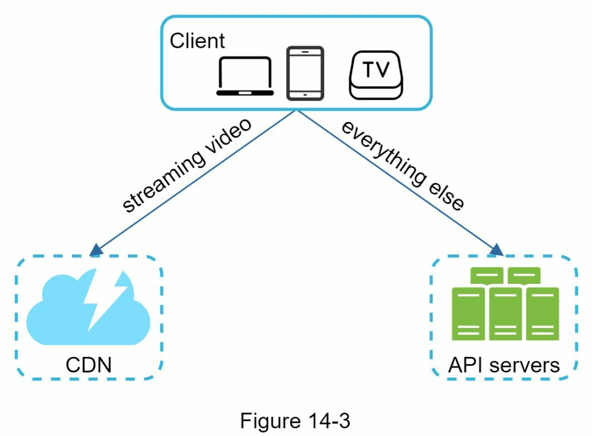
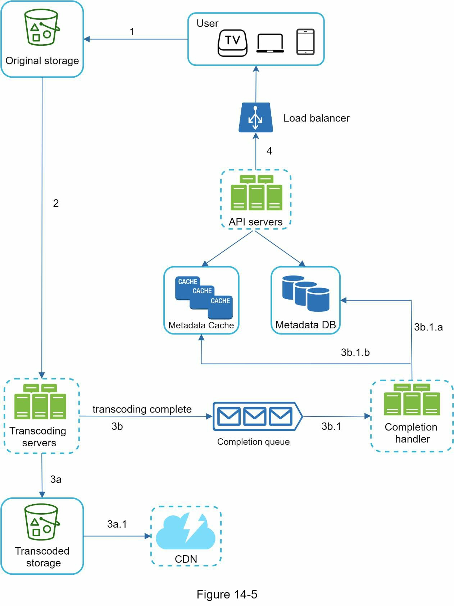
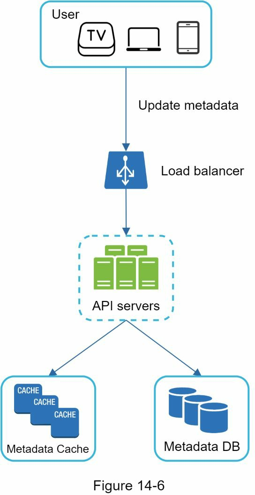
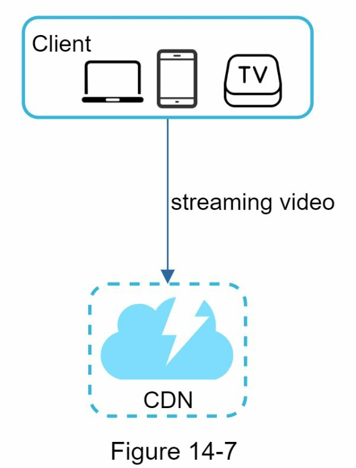
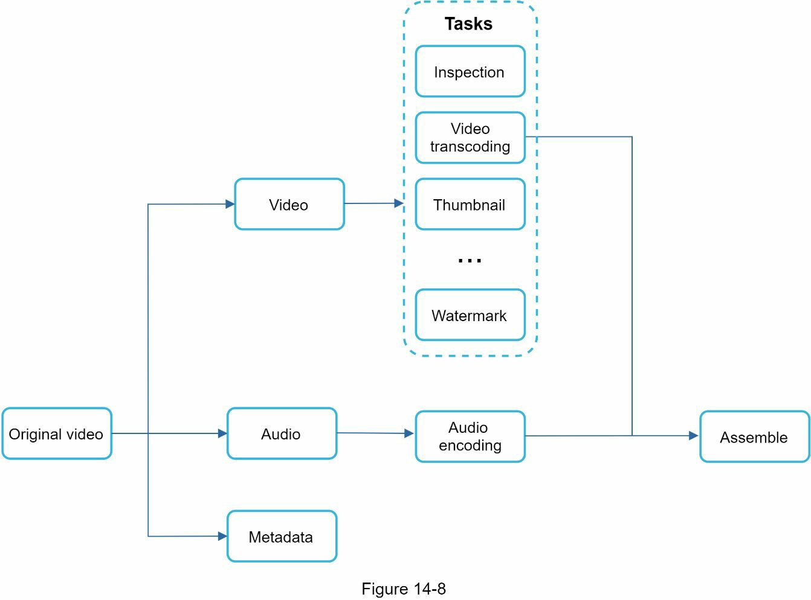
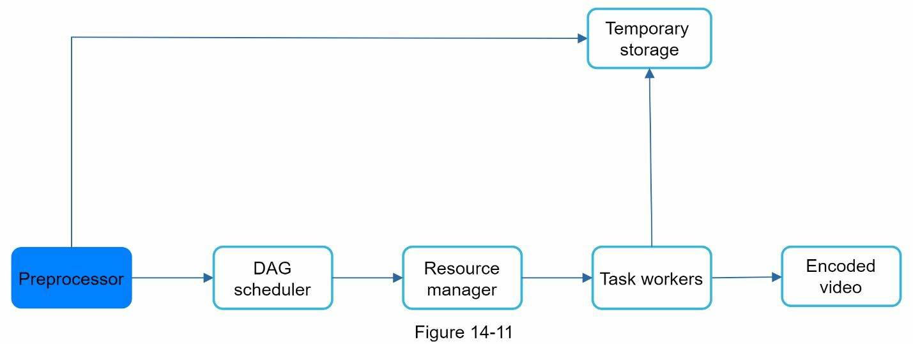
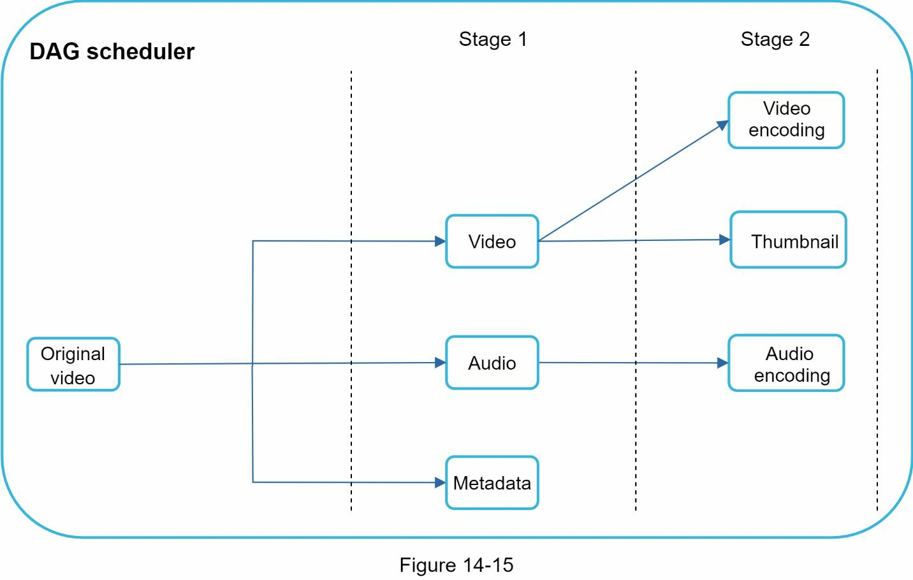
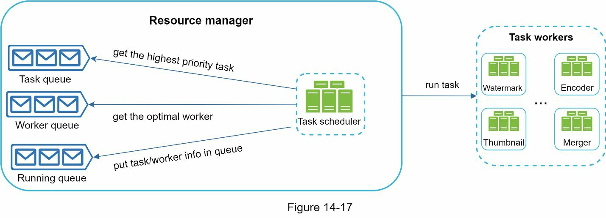
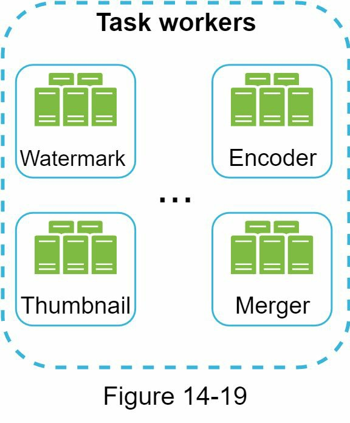

## 粗略估计
 - 假设该产品有 500 万日活跃用户（DAU）。
 - 用户每天观看 5 个视频。
 - 10%的用户每天上传 1 个视频。
 - 假设平均视频大小为 300MB。
 - 每天需要的总存储空间。500 万*10%*300MB=150TB
 - CDN 成本。
    - 当云 CDN 提供视频时，你要为从 CDN 传输出来的数据收费。
    - 让我们使用亚马逊的 CDN CloudFront 进行成本估算。假设 100%的流量都来自美国。每 GB 的平均成本是 0.02 美元。为简单起见，我们只计算视频流的成本。
    - 500 万 * 5 个视频 * 0.3GB * 0.02 美元 = 每天 150,000 美元。

## 高层次的设计
 - 客户端：你可以在你的电脑、移动电话和智能电视上观看 YouTube。
 - CDN：视频存储在 CDN 中。当你按下播放键时，视频会从 CDN 上流传下来。
 - API 服务器。除了视频流之外，其他一切都要通过 API 服务器。这包括订阅推荐、生成视频上传 URL、更新元数据数据库和缓存、用户注册等。

### 视频上传

1. 视频被上传到原始存储器。
2. 转码服务器从原始存储中获取视频并开始转码。
3. 一旦转码完成，以下两个步骤将平行执行。  
  3a. 转码后的视频被发送到转码后的存储器。  
  3b. 转码完成事件被排入完成队列。  
  3a.1. 转码后的视频被分发到 CDN。  
  3b.1. 完成处理程序包含一堆工作线程，不断从队列中提取事件数据。   
  3b.1.a.和 3b.1.b. 完成处理程序在视频转码完成后更新元数据数据库和缓存。
4. API 服务器通知客户端，视频已经成功上传，可以进行流媒体播放。
### 更新元数据  
 当文件被上传到原始存储区时，并行的客户端会发送一个更新视频元数据的请求，如图 14-6 所示。该请求包含视频元数据，包括文件名、大小、格式等。API 服务器更新元数据缓存和数据库。
 
### 视频流流程
 每当你在 YouTube 上观看一个视频时，它通常立即开始流媒体，你不会等到整个视频被下载。下载意味着整个视频被复制到你的设备上，而流媒体意味着你的设备不断接收来自远程源视频的视频流。  
 视频直接从 CDN 进行流式传输。离你最近的边缘服务器将提供视频。因此，延迟非常小。  
 

## 深入设计
### 视频转码
当你录制视频时，设备（通常是手机或相机）会给视频文件一个特定的格式。如果你想让视频在其他设备上顺利播放，视频必须被编码成兼容的比特率和格式。
### 有向无环图（DAG）模型
转码视频的计算成本很高，而且很耗时。此外，不同的内容创作者可能有不同的视频处理要求。例如，有些内容创作者需要在视频上面加水印，有些自己提供缩略图，有些上传高清视频，而有些则不需要。  
为了支持不同的视频处理管道并保持高度的并行性，必须增加一些抽象层次，让客户端程序员定义要执行哪些任务。例如，Facebook 的流媒体视频引擎使用了一个有向无环图（DAG）编程模型，该模型分阶段定义任务，因此它们可以按顺序或平行地执行。  
 
原始视频被分割成视频、音频和元数据。下面是一些可以应用于视频文件的任务。
 - 检查。确保视频有良好的质量，没有畸形。
 - 视频编码。视频被转换以支持不同的分辨率、编解码、比特率等。
 - 缩略图。缩略图可以由用户上传或由系统自动生成。
 - 水印。在你的视频上面叠加一个图像，包含关于你视频的识别信息。

### 视频转码架构
 

#### 预处理器
预处理器有 4 个职责。
1. 视频拆分。视频流被分割或进一步分割成更小的图片组（GOP）排列。GOP 是一组/大块的帧按特定顺序排列。每个块是一个独立的可播放单元，通常是几秒钟的长度。
2. 一些旧的移动设备或浏览器可能不支持视频分割。预处理程序通过 GOP 对齐方式为老客户分割视频。
3. DAG 生成。处理器根据客户程序员编写的配置文件生成 DAG。

#### DAG 调度器
把 DAG 图分割成各阶段的任务，并把它们放在资源管理器的任务队列中。
 

#### 资源管理器
资源管理器负责管理资源分配的效率。
 - 任务队列。它是一个优先级队列，包含要执行的任务。
 - 工作队列。它是一个优先级队列，包含工人的利用信息。
 - 运行队列。它包含关于当前运行的任务和运行任务的工作者的信息。
 - 任务调度器。它挑选最佳任务/工作者，并指示所选的任务工作者执行工作。
 

#### 任务组
任务工作者运行在 DAG 中定义的任务。
 

#### 临时存储
元数据经常被工作者访问，而且数据大小通常很小。因此，在内存中缓存元数据是一个好主意。

### 系统优化
#### 速度优化
1. 将一个视频作为一个整体上传是低效的。我们可以通过 GOP 对齐将视频分成小块，这允许在前一次上传失败时快速恢复上传。按 GOP 分割视频文件的工作可以由客户端实现，以提高上传速度。  
2. 将上传中心放在靠近用户的地方 另一个提高上传速度的方法是在全球范围内建立多个上传中心， 为了实现这一目标，我们使用 CDN 作为上传中心。  
3. 为了使系统更加松散耦合，我们引入了消息队列.
 - 在引入消息队列之前，编码模块必须等待下载模块的输出。
 - 引入消息队列后，编码模块不需要再等待下载模块的输出。如果消息队列中存在事件，编码模块可以并行地执行这些工作。
